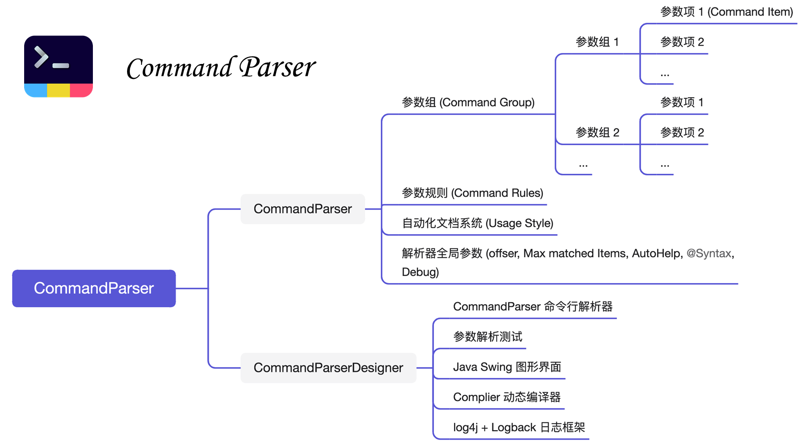

# About Command Parser

CommandParser is a lightweight Java platform for quickly developing, parsing, and managing command-line arguments. It provides a basic graphical interface (CommandParserDesigner) for managing and editing command items visually.

CommandParser has the following advantages:

- **Cross-platform**: It is developed based on Java8, and all software libraries are standardized, which can be run in a wide range of devices and JDK versions.
- **GUI-platform**: Commandparserdesigner-1.1. jar provides user-friendly graphical design and management functions to help developers easily preview and manage parsers with hundreds or thousands of parameters. Graphically designed parsers can directly export Java script files to run.
- **Script designer**: CommandParser supports pure script development, and parameter registration can be completed by invocation chaining. Script files can also be imported into GUI platform for visually editing and management.
- **Lightweight**: The commandParser-1.1.jar only occupies 300+ KB with no external dependencies. The core program package is separated from the graphical interface program to reduce the package size.
- **Single line parse**: It completes parsing of string arrays or files by `parser.parse (...)`.
- **Automated documents and highly customizable**: automated documents meet almost all requirements for document designing, and open interface design allows users to customize document styles.
- **Support predetermined rules between parameter sets**: complete verification of mutual exclusion and parameter dependency relationships in the parsing stage to reduce the amount of extra code;
- **Development mode**: Allows debugging parameters and user parameters to be developed in the same script file without interfering with each other.

> [!COMMENT|label:Contact Developer]
> Liubin Zhang, suranyi.sysu@gmail.com