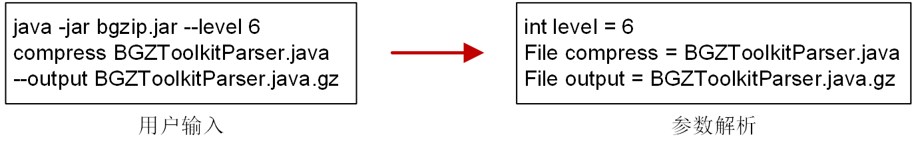

# What is command-line-interface?

**Command Line Interface (CLI)** is a text-based user interface for running programs, managing computer files, and interacting with computers. Command-line interfaces, like software graphical interfaces and Web services, are used to transform the internal form of program operation from the human-acceptable form. Generally, the command line interface accepts the commands entered by the user's keyboard, and resolves the commands into parameters or Settings of different programs, and finally initiates the back-end computing tasks.

In Java, the program is packaged as a runnable JAR package, which can be easily transferred and used between different platforms, without the need to consider the IDE environment and tedious configuration. A JAR package usually contains all the code needed to complete a set of calculation/analysis/service. In order to enable the JAR package to perform different tasks according to different input parameters, the command line needs to be efficiently parsed. An effective command line parsing tool helps improve development efficiency and user interaction experience.

