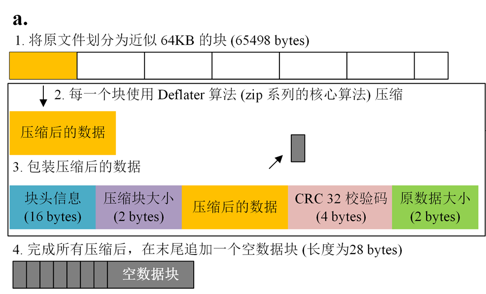
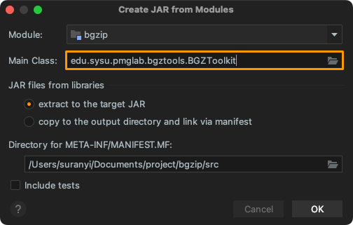
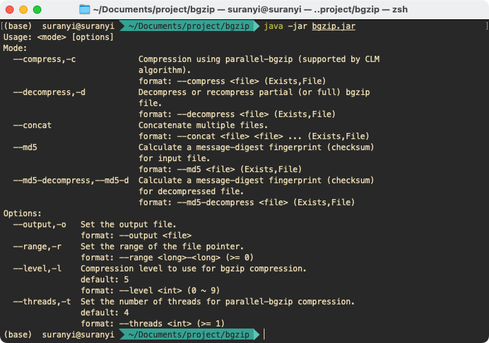
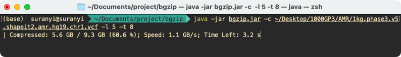

# About BGZToolkit {#项目概述}

BGZIP is a common compression tool in the field of bioinformatics. BGZIP tool cuts the input file into small blocks ( approximately 64KB) and compresses them into a series of small BGZF blocks by Deflater respectively. This principle makes it possible for building indexes against the compressed blocks, which allows quickly retrieving parts of the data without decompressing the entire file.

We developped this project with pure Java script for manipulating BGZ files, including parallel compression, decompression, file concat, md5 check and so on.



| Type            | URL                                                         |
| :-------------- | :---------------------------------------------------------- |
| **Software**    | http://pmglab.top/commandParser/bgzip/bgzip.jar             |
| **Source**      | http://pmglab.top/commandParser/bgzip/BGZToolkit.java       |
| **Parser File** | http://pmglab.top/commandParser/bgzip/BGZToolkitParser.java |

# API {#API-方法}

The main API methods for BGZIP can be found in `edu.sysu.pmglab.bgztools.BGZToolkit`, which has been integrated in the commandParser package), including:

- **compression:** BGZToolkit.Compress.instance(File inputFile, File outputFile)
  - Set the number of threads for parallel-bgzip compression: .setThreads(int nThreads)
  - Set the range of the file pointer: .limit(long start, long end)
  - Set compression level for compression: .setCompressionLevel(int compressionLevel)
- **decompression:** BGZToolkit.Extract.instance(File inputFile, File outputFile)
  - Set the number of threads for parallel-bgzip decompression: .setThreads(int nThreads)
  - Set the range of the file pointer: .limit(long start, long end)
  - Set the output format (compressed or not): .setOutputParam(BGZOutputParam outputParam)
- **md5 check:** BGZToolkit.MD5.instance(File inputFile)
  - Calculate md5 for decompressed file or not: .setDecompression(boolean decompression)
- **concat:** BGZToolkit.Concat.instance(File[] inputFiles, File outputFile)

When the instantiation task is completed, submit the corresponding task by `.submit()`.

# Design Parser {#根据-API-设计解析器}

The BGZIP toolset has 5 independent modes of operation, including Compression, Decompression, Concat, MD5 Check, MD5 Check (decompressed file), and there are 5 parameters in total, including the number of threads, file pointer range, output file, compression level, and whether to print the program log. The creation steps are as follows:

**Step1:** Create command group：Mode and Options;

**Step2:** Create command items for `Mode` group: --compress; --decompress; --concat; --md5; --md5-decompress;

**Step3:** Create command items for `Options` group: --output; --range; --level; --threads;

**Step4:** Create command rules: 

- command item --compress, --decompress, --concat, --md5, -- md5-decompress must be passed one;
- --output, --range, --level, --threads cannot be used when the --md5 or --md5-decompress mode is actived;
- --range, --level, --threads cannot be used when the --concat mode is actived;

**Step5:** Set program name to: `<mode>`;

**Step6:** [Export to Java Script Builder With Options Format](http://pmglab.top/commandParser/bgzip/BGZToolkitParser.java).

# Design Main Function {#设计主函数}

Use CommandParser to bridge input parameters with business logic. See: [BGZToolkit.java](http://pmglab.top/commandParser/bgzip/BGZToolkit.java).

```java
public static void main(String[] args) {
    try {
        BGZToolkitParser options = BGZToolkitParser.parse(args);
        if (options.getOptions().isHelp()) {
            System.out.println(BGZToolkitParser.usage());
            return;
        }

        if (options.compress.isPassedIn) {
            // 压缩文件
            long startTime = System.currentTimeMillis();
            File outputFile = options.output.isPassedIn ? options.output.value : options.compress.value.addExtension(".gz");
            Compress task = Compress.instance(options.compress.value, outputFile)
                    .setThreads(options.threads.value)
                    .setCompressionLevel(options.level.value)
                    .setPrintLog(true);

            if (options.range.isPassedIn) {
                task.limit(options.range.value[0], options.range.value[1]);
            }
            task.submit();
            logger.info("Compression completed. Total time: {} s; File size: {}", (System.currentTimeMillis() - startTime) / 1000d, outputFile.formatSize(3));
            return;
        }

        if (options.decompress.isPassedIn) {
            long startTime = System.currentTimeMillis();

            // 解压文件
            File outputFile;
            Extract task;
            if (options.output.isPassedIn) {
                outputFile = options.output.value;

                task = Extract.instance(options.decompress.value, outputFile)
                        .setThreads(options.threads.value);

                if (options.level.isPassedIn || options.output.value.withExtension(".gz")) {
                    task.setOutputParam(new BGZOutputParam(options.level.value));
                }
            } else {
                if (!options.level.isPassedIn) {
                    // 没有传入 level 时, 认为是解压文件
                    outputFile = options.decompress.value.changeExtension("", ".gz");
                    if (outputFile.equals(options.decompress.value)) {
                        logger.error("can't remove an extension from {} -- please rename", options.decompress.value);
                        return;
                    }
                } else {
                    // 传入了 level, 认为是提取文件子集
                    if (options.decompress.value.withExtension(".gz")) {
                        logger.error("missing required positional argument: --output");
                        return;
                    } else {
                        outputFile = options.decompress.value.addExtension(".gz");
                    }
                }

                task = Extract.instance(options.decompress.value, outputFile)
                        .setThreads(options.threads.value);
            }

            if (options.range.isPassedIn) {
                task.limit(options.range.value[0], options.range.value[1]);
            }

            task.submit();

            logger.info("Decompression completed. Total time: {} s; File size: {}", (System.currentTimeMillis() - startTime) / 1000d, outputFile.formatSize(3));
            return;
        }

        if (options.concat.isPassedIn) {
            // 连接文件
            long startTime = System.currentTimeMillis();
            if (!options.output.isPassedIn) {
                logger.error("missing required positional argument: --output");
                return;
            }

            Concat.instance(options.concat.value, options.output.value).submit();

            logger.info("Concat completed. Total time: {} s; File size: {}", (System.currentTimeMillis() - startTime) / 1000d, options.output.value.formatSize(3));
            return;
        }


        // md5 校验文件
        if (options.md5.isPassedIn) {
            MD5 task = MD5.instance(options.md5.value);
            task.setDecompression(false);
            System.out.println("MD5 (" + options.md5.value + ") = " + task.submit());
            return;
        }

        if (options.md5Decompress.isPassedIn) {
            MD5 task = MD5.instance(options.md5Decompress.value);
            task.setDecompression(true);
            System.out.println("MD5 (" + options.md5Decompress.value + ") = " + task.submit());
            return;
        }
    } catch (Exception | Error e) {
        logger.error("{}", e.getMessage(), e);
    }
}
```

# Create Jar Package {#创建-jar-包}

Click: "Project Structure..."> "Artifacts" > "+" > "JAR" > "From modules with dependencies...". Select the entry function in Main Class, and packaged as [bgzip.jar](http://pmglab.top/commandParser/bgzip/bgzip.jar):



Go to the folder where `bgzip.jar` is located, and enter the command on the console to display the document:

```shell
java -jar bgzip.jar
```



# Example {#应用-BGZToolkit}

## 1. Compress a single file with multiple threads

```bash
# Download from: http://pmglab.top/genotypes/#/
java -jar bgzip.jar -c ~/Desktop/1000GP3/AMR/1kg.phase3.v5.shapeit2.amr.hg19.chr1.vcf -l 5 -t 8
```



## 2. Decompress a file and recompress into BGZIP format

```bash
# Extract the first 1 GB of content
java -jar bgzip.jar -d ~/Desktop/1000GP3/AMR/1kg.phase3.v5.shapeit2.amr.hg19.chr1.vcf.gz \
--range 0-1073741824 -o ~/Desktop/subFile.vcf.gz

# Decompress the above file
java -jar bgzip.jar -d  ~/Desktop/subFile.vcf.gz
```

## 3. Verify the MD5 code of a file

```bash
# Result: 29ccebe9d2748328f6cc8b16c6563261
java -jar bgzip.jar --md5 ~/Desktop/subFile.vcf

# Result: 29ccebe9d2748328f6cc8b16c6563261
java -jar bgzip.jar --md5-d ~/Desktop/subFile.vcf.gz
```

## 4. Connect multiple files

```bash
# Split a file into 2 files
java -jar bgzip.jar -d ~/Desktop/1000GP3/AMR/1kg.phase3.v5.shapeit2.amr.hg19.chr1.vcf.gz \
--range 0-536870912 -o ~/Desktop/subFile1.vcf.gz
java -jar bgzip.jar -d ~/Desktop/1000GP3/AMR/1kg.phase3.v5.shapeit2.amr.hg19.chr1.vcf.gz \
--range 536870912-1073741824 -o ~/Desktop/subFile2.vcf.gz

# Concatenate two subfiles
java -jar bgzip.jar --concat ~/Desktop/subFile1.vcf.gz ~/Desktop/subFile2.vcf.gz -o ~/Desktop/subFile.merge.vcf.gz

# Check md5, result: 29ccebe9d2748328f6cc8b16c6563261
java -jar bgzip.jar --md5-d  ~/Desktop/subFile.merge.vcf.gz   
```

