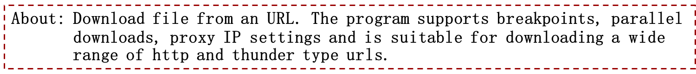
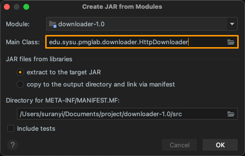
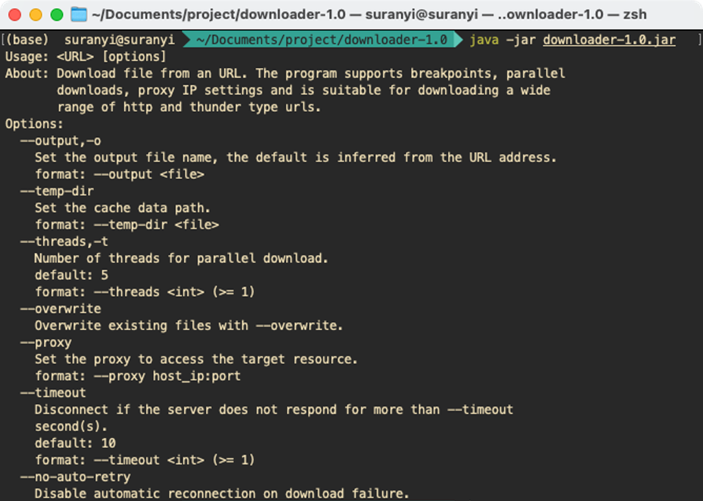
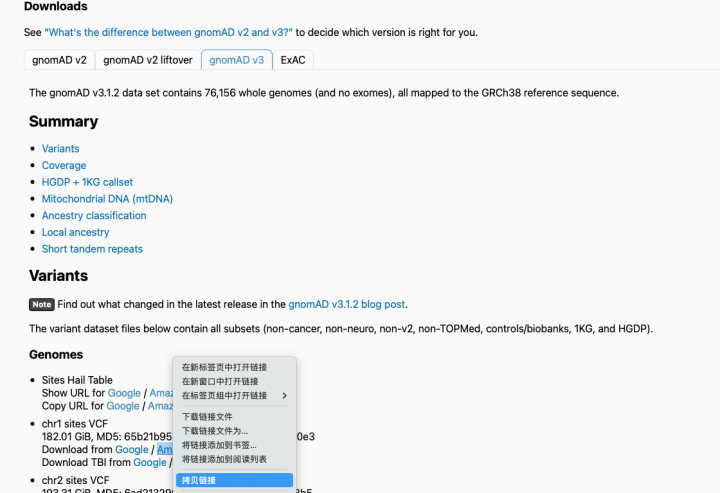
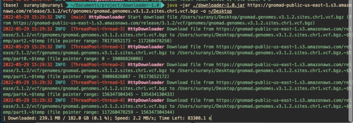
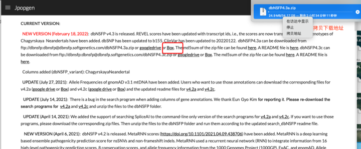
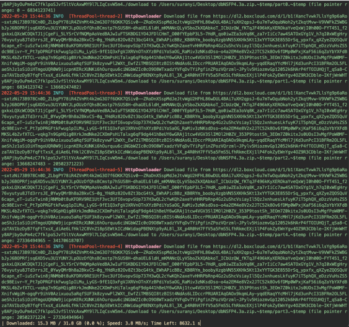

# About HttpDownloader {#项目概述}

Bioinformatics/medical informatics research requires a large number of public data resources. However, these resources are accompanied with many problems (e.g., redirection jump, speed limit in the cloud, breakpoint transfer, etc.) when downloading due to their huge data volume (e.g., dbNSFP database reaches over 30 GB, GnomAD database reaches over 1 TB). In order to simplify the process of downloading and updating these databases, and to effectively integrate this process as an API tool into other public projects (here mainly for Java development), we have developed HttpDownloader. in addition, support for FTP downloads is being planned.

HttpDownloader is a simple Http downloader based on the Java platform, designed to enhance the basic resource download functionality. It currently supports: breakpoint transfer, URL redirection based on the Location of the response header, parallel download (requires the server to support chunked or get 206 response codes after sending segmented requests), download resources with dynamically obtained file size, set proxy.

| Type            | URL                                                          |
| :-------------- | :----------------------------------------------------------- |
| **Software**    | http://pmglab.top/commandParser/downloader/downloader-1.0.jar |
| **Source**      | http://pmglab.top/commandParser/downloader/HttpDownloader.java |
| **Parser File** | http://pmglab.top/commandParser/downloader/HttpDownloaderParser.java |

# API {#API-方法}

HttpDownloader 的主要 API 方法可以在 edu.sysu.pmglab.downloader.HttpDownloader 中找到 (现已集成在 CommandParser 包中), 分别为:

- **download:** HttpDownloader.instance(String url)
  - Number of threads for parallel download: .setThreads(int nThreads)
  - Set the output file name: .setOutputFile(File outputFile) 和 .setOutputFile(String outputFileName)
  - Set the cache data path: .setTempDir(File tempDir) 和 .setTempDir(File tempDirName)
  - Set the proxy: . setProxy(String host, String port) 和 .setProxy(String hostPort)
  - Set the maximum wait time (unit: second): .setTimeOut(int timeOut)
  - Overwrite existing files with: .clean(boolean clean)

When the instantiation task is complete, submit the corresponding task via `.download()`.

# Design Parser {#根据-API-设计解析器}

The first input parameter of the HttpDownloader is identified as the URL address, and from the second input parameter onwards it is parsed as options. The parser creation steps are as follows:

**Step1:** Create command group：Options;

**Step2:** Create command items for `Options` group: --output; --temp-dir, --threads, --overwrite, --proxy, --time-out, --no-auto-retry;

**Step3:** Set program name to: `<mode>`, offset to `1`;

**Step4:** Set the Usage Style to `Unix_Style_3` and set the subtitle as follows:



**Step5:** [Export to Java Script Builder With Options Format](http://pmglab.top/commandParser/downloader/HttpDownloaderParser.java).

# Design Main Function {#设计主函数}

Use CommandParser to bridge input parameters with business logic. See: [HttpDownloader.java](http://pmglab.top/commandParser/downloader/HttpDownloader.java).

```java
public static void main(String[] args) {
    try {
        if (args.length == 0) {
            System.out.println(HttpDownloaderParser.getParser());
            return;
        }

        HttpDownloaderParser parser = HttpDownloaderParser.parse(args);
        if (parser.help.isPassedIn) {
            System.out.println(HttpDownloaderParser.getParser());
            return;
        }

        do {
            try {
                HttpDownloader.instance(args[0])
                        .setOutputFile(parser.output.value)
                        .setThreads(parser.threads.value)
                        .setPrintLog(true)
                        .setTempDir(parser.tempDir.value)
                        .setProxy(parser.proxy.value)
                        .setTimeOut(parser.timeout.value)
                        .clean(parser.overwrite.isPassedIn)
                        .download();
            } catch (IOException e) {
                logger.error("{}", e.getMessage());

                if (!parser.noAutoRetry.isPassedIn) {
                    logger.error("Download failed, resume download in 3 seconds.");

                    Thread.sleep(3000);
                    continue;
                }
            }

            break;
        } while (true);
    } catch (Exception | Error e) {
        logger.error("{}", e.getMessage());
    }
}
```

# Create Jar Package {#创建-jar-包}

Click on: Project Structure... > Artifacts > + > JAR > From modules with dependencies... .In Main Class, select the entry function, and packaged as [downloader-1.0.jar](http://pmglab.top/commandParser/downloader/downloader-1.0.jar):



Go to the folder where `downloader-1.0.jar` is located and enter the command on the console to display the document:

```shell
java -jar downloader-1.0.jar
```



# Example {#应用-HttpDownloader}

## 1. Download [gnomAD](https://link.zhihu.com/?target=https%3A//gnomad.broadinstitute.org/downloads)

The Genome Aggregation Database (gnomeAD) is a collaborative genomic mutation frequency database created by national researchers to aggregate and coordinate large-scale sequencing projects at different levels, including whole-exome and whole-genome data, for a wide range of scientific research communities. The database currently includes 125,748 whole-exome data and 15,708 whole-genome data (v2) from different disease research projects and large population sequencing projects. The database includes the previously used 1,000 genomes data, the ESP database and most of the ExAC database.

Amazon's links support parallel downloading and resumable without the need for a proxy.



```shell
java -jar ./downloader-1.0.jar https://gnomad-public-us-east-1.s3.amazonaws.com/release/3.1.2/vcf/genomes/gnomad.genomes.v3.1.2.sites.chr1.vcf.bgz -o ~/Desktop 
```



## 2. Download [dbNSFP](https://sites.google.com/site/jpopgen/dbNSFP)

dbNSFP is a database developed for functional prediction and annotation of all potential non-synonymous single-nucleotide variants (nsSNVs) in the human genome. Its current version is based on the Gencode release 29 / Ensembl version 94 and includes a total of 84,013,490 nsSNVs and ssSNVs (splicing-site SNVs).  It compiles prediction scores from 38 prediction algorithms (SIFT, SIFT4G, Polyphen2-HDIV, Polyphen2-HVAR, LRT, MutationTaster2, MutationAssessor, FATHMM, MetaSVM, MetaLR, MetaRNN, CADD, CADD_hg19, VEST4, PROVEAN, FATHMM-MKL coding, FATHMM-XF coding, fitCons x 4, LINSIGHT, DANN, GenoCanyon, Eigen, Eigen-PC, M-CAP, REVEL, MutPred, MVP, MPC, PrimateAI, GEOGEN2, BayesDel_addAF, BayesDel_noAF, ClinPred, LIST-S2, ALoFT), 9 conservation scores (PhyloP x 3, phastCons x 3, GERP++, SiPhy and bStatistic) and other related information including allele frequencies observed in the 1000 Genomes Project phase 3 data, UK10K cohorts data, ExAC consortium data, gnomAD data and the NHLBI Exome Sequencing Project ESP6500 data, various gene IDs from different databases, functional descriptions of genes, gene expression and gene interaction information, etc.



```shell
java -jar ./downloader-1.0.jar https://dl2.boxcloud.com/d/1/b1\!XancTvwk7LlsYg9p6aRo-sxtzNi73B978Cn0D_ZLbgPY78iR4ZVnMt4k2mG3O7f6OKK7QSiv0--ZRoDnXSspMdJeJtvWgU2HFHL86wDUL4BAi7uXH2qpsJ-6u7mTwOqubNoh2ytZkqtMvw-V9VWFkZ5WBGbJyJ6BOPRfjsq6XD5vu3U1YUNYJLpOUzDfQhsBCmstp7hSUS8H-dhaUEL6ldH_mKMANcQLyVSboZkXQAbkoT_ICbUzQW_fKTqJF496kKyXEROkaYveQxWjI0h00O-FYT451_f2gxkxLQXcWCOQkTJ1jCgeFi_5LYSrCVfNQMpAoVedBAJwIuFTSKBDG1YO4JFDlCHmT_O00fYEpbP3L5-7HdR_qo0iwZEa3oVq8K_za7rIiCc7aw4SATOxGYg1V_h7qI0xWEgHry76vyutyu8JTd3rrsJE_0YwyQMrBh8a2BkvCS-0g_YHdRz82Ov8Zt3bcG4tk_EWhAPicBBz_KB8RYm_boobyXzgbVN55XKHk5Kt13xYYTGK3E855DrSq_ypxfx_qXZyeZQOSQuV6capn_eT-iuSzTwin8jRNMb0t8uKFDRV9RE1UtF3vc3UfI6vopvSUp737H3wQL2cYwKQh2axeYvHHRPbRnp4Gz2uShcVsiayIl5QzJxnhuesLkfuyK7iT5phQX_eDzzVuHsZS5dc9BEivr-Y_Pt7pDPRGFtkFwug1pILMu_LyGS-9fE1Q3xFgVJXRVnOTnXYzBPdiYoSaOG_RaMiv3zNKsdDso-o4a2EM4e8V2x2JTC52k8Ov6fDMp0WPxjKaF56i6qZoYbYXFdBMKSL4bZvfXTCL-vqkg7n9GpHQig0XrkJmdNke2CXOmPsHiTalxg6qF9dg441hBeUY6wGRAj1tcw4VGV3SlIMOl2H0ZV_353P9tostSh_3EOm7Z0kitxJs0UOsI3vMgfPoW0MF-XnifvWgiM-ogqPr9ihV0Azixuou5aRqfSUF3k8zyvwPl2WXt_EwfZiTMBSQI8tzBISt4NdAs6LIDccrPRUARIAqOAOx9kqmLAy-yqdERaqYYcMHl7jKd3unPcI31BFRm2OL5FLaeShJz1oSiOiHTmgoUQR0W9jicpnKERcXUNKi6hOurquu6ciNGbWZIc0cO9O8WTxadzYVFqDvTYiPgfinZPozVQrzml-JPylv5HiozmvGp12052k6HArP4fTOIUHQjT_qSa8-CzaTAVIbzDyB7fqFtTxsX_diAe6LfHkl2C8VnZ18pSEWtkICzNWidagPBENXtp9yAL8l_3X_p4R0hH7FfV5a5FmS5LfhRkmcEXj1lP4FokZyEWnYgv4OZ9R3CDble-IKfjWnWHTy8APjbyOuPm4zC7fklpoSJvfSltVcAxwMY9l7LIqCsvW5m4./download -o ~/Desktop/dbNSFP4.3a.zip
```


