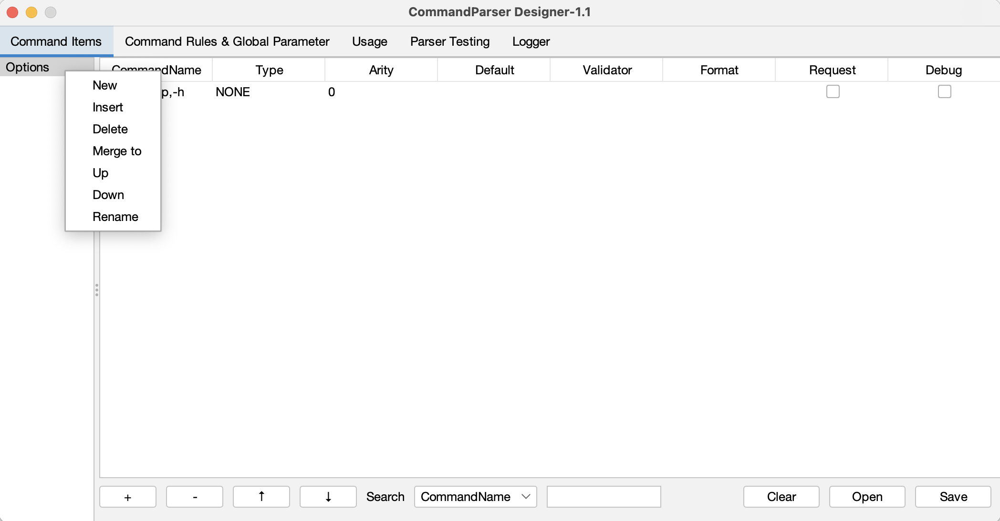
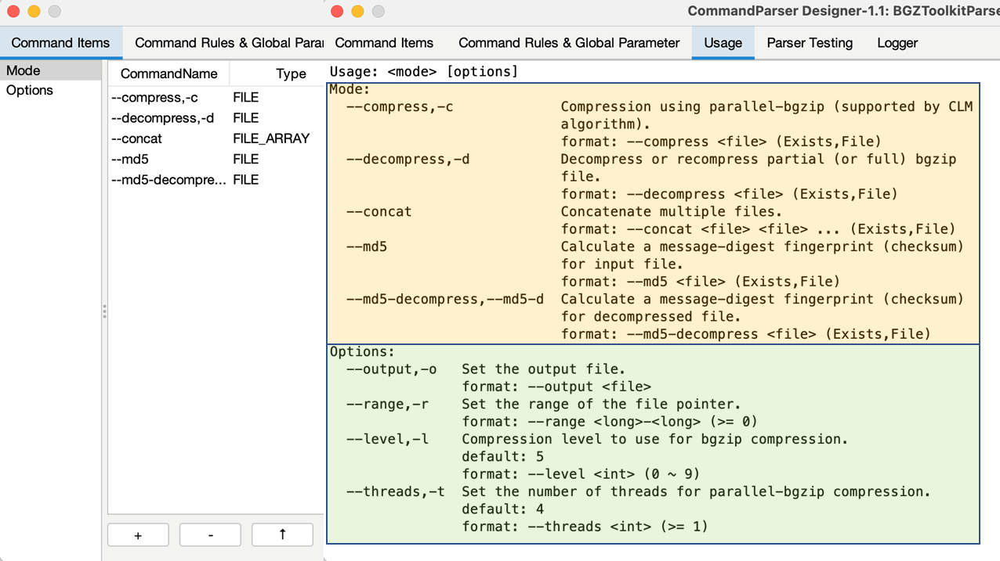
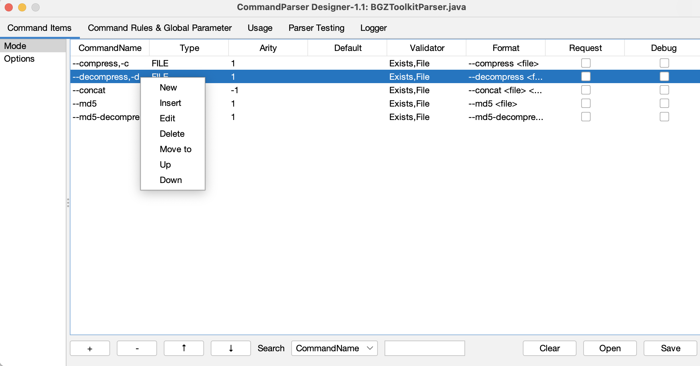
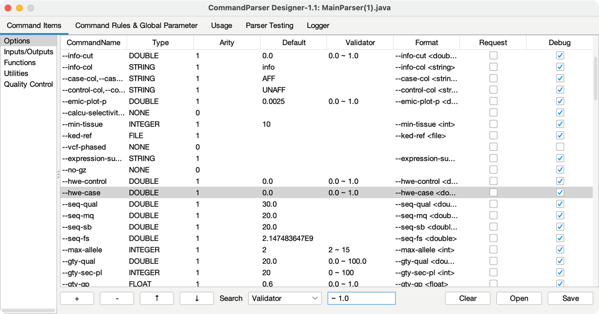
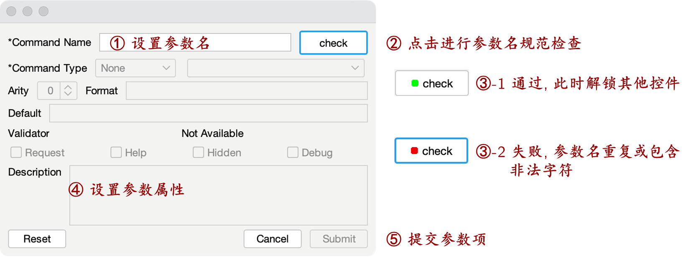

# Command Group Management {#管理参数组}

Command items can be roughly divided into several categories according to their functions or attributes, these categories are named as command groups. In CommandParser, the command group is the basic unit for organizing command items. When initializing the parser, a command group name `Options` will be created by default and the first command item (` --help, -help, -h `) used to export help document in this command group will be created automatically.

On the `Command Items` tab, the command group panel is on the left. Click the right mouse button in the blank area of the command group panel or select the command group to expand the management menu. The management menu contains the following seven operations:

- **New:** Create a new command group.
- **Insert:** Insert a new command group at the current location.
- **Delete:** Delete the selected command group.
- **Merge to:** Merge all command items from this command group to another command group.
- **Up:** Move up the selected command group.
- **Down:** Move down the selected command group.
- **Rename:** Rename the command group.

The order of the command groups will affect the order of the command groups displayed in the automated document:

# Command Item Management {#管理参数项}

On the `Command Items ` tab, the command items panel is on the right. Right click a command item or the blank area of the command items panel to expand the management menu. The management menu contains the following seven operations:

- **New:** Create a new command item (shortcut: Ctrl + N).
- **Insert:** Insert a new command item at the current position.
- **Edit:** Edit the command item (shortcut: Double-click the command item).
- **Delete:** Delete the selected command item (shortcut: Ctrl + Delete).
- **Merge to:** Merge the selected command item to another command group.
- **Up:** Move up the selected command item (shortcut: Ctrl + U).
- **Down:** Move down the selected command item (shortcut: Ctrl + D).

In the menu bar below, "+" corresponds to New, "-" corresponds to Delete, "↑" corresponds to Up, and "↓" corresponds to Down.

# Search Command Item {#搜索参数项}

In the search box at the lower part of the command items panel (shortcut: Ctrl + F), users can set the search attribute (check box) and content (text box, ignores case), and then press the Enter to search the matched command items.

# Edit Command Item {#编辑参数项}

The basic work unit of the CommandParser is Command Item, which has declared the keyword, the number of parameters, the transformation from the captured values to Java object, and the validation of the captured values.

When creating or editing a command item, the command item sub-panel will pop up, which contains 12 command properties. `Command Name` and `Command Type` are two mandatory attributes, which help to define the keyword and data Type of this command item.

The description of each property is shown as following:

| Propertie                  | Description                                       |
| :--------------------------------------- | :----------------------------------------------------------- |
| Command Name                 | 1. Separate with commas if the command item has multiple names (e.g. `--output,-o`), and the first name will be regarded as the main command name.  2. Format of parameter name: 0-9A-ZA-Z +-\_. 3. Click the Check button to check for the format and duplicate names after entering the command name. Only the eligible command name can have other properties and be submitted. |
| [Command Type](#参数格式) | 1. Including None (by default, check whether be passed in or not), Boolean, Byte, Short, Integer, Long, Float, Double, String, File. 2. Derived data types: Value, Array, Set, Range etc. |
| [Validator](#参数验证器) | Different types of command item have different validators, see details in [Validator](#参数验证器). |
| Default                     | The default value should be transform by Command Type and validated by the Validator. And the input format should be consistent with the format defined by `Format ` and `Arity`. |
| Arity                      | Set the arity. "-1" indicates an indefinite length (0 parameter is also approved). All parameters before the next command item are regarded as the value of this command item. |
| Format               | The format is set according to Command Type (usually be set as: Primary Command Name + Default format). |
| Description          | The description document of command item. |
| Help             | When a command item marked `Help` is passed in, the format transformation and validators will be disabled. |
| Request              | The command item marked `Request` must be passed in. |
| Hidden       | The command item marked `Hidden` will not be displayed in the document. |
| Debug     | When the parser is in `non-Debug mode`, the command item marked `Debug` is disabled, and the corresponding command rule will be invalidated, and the command item will not be displayed in the document. |

# Command Type {#参数格式}

Command Type `MainType.DerivedType`. Main types include IType.NONE (check whether be passed in or not), BOOLEAN, BYTE, SHORT, INTEGER, LONG, FLOAT, DOUBLE, STRING, FILE. Derived types include the following 16 types. The default format document (i.e., `CommandName Format`) will be assigned once the type is specified. Types with the `... ` tag can use `arity` to control the number of parameters.

| Command Derived Type | Default Format      |
| :-------------------- | :---------------------------------------- |
| VALUE                 | value                                     |
| ARRAY                 | value value …                             |
| ARRAY_COMMA           | value,value,…                             |
| ARRAY_SEMICOLON       | value;value;…                             |
| SET                   | value value …                             |
| SET_COMMA             | value,value,…                             |
| SET_SEMICOLON         | value;value;…                             |
| MAP                   | key=value key=value …                     |
| MAP_COMMA             | key=value,key=value,…                     |
| MAP_SEMICOLON         | key=value;key=value;…                     |
| RANGE                 | value-value                               |
| LABEL_RANGE           | label:value-value label:value-value …     |
| LABEL_RANGE_COMMA     | label:value-value,label:value-value,…     |
| LABEL_RANGE_SEMICOLON | label:value-value;label:value-value;…     |
| LABEL_ARRAY           | label:value,value,… label:value,value,…   |
| LABEL_ARRAY_SEMICOLON | label:value,value,…;label:value,value,…;… |

# Validator {#参数验证器}

Validators for different types of command item are shown as below:

| Command Type                              | Support Types                                                |
| :---------------------------------------- | :----------------------------------------------------------- |
| None, Boolean                             | Don't support validator                                      |
| Byte, Short, Integer, Long, Float, Double | Validators for numeric range : 1. Range (including boundary values): minimum to maximum;  2. Specify minimum value: ≥ minimum value. |
| String                                    | Validators for qualified values:  Multiple qualified values are separated by spaces. ignoreCase: whether to ignore case or not; indexAccess: allow the use of indexes instead of specific values (0 represents the first qualified value...). |
| File                                      | Validators for files:  File Exists: The file path must exist.  Single File: The file path cannot be a folder;  Directory: The file path must be a folder;  Inner Resource: Preferentially identifying the resources of the current runtime  (allowing access to the internal JAR files). |

