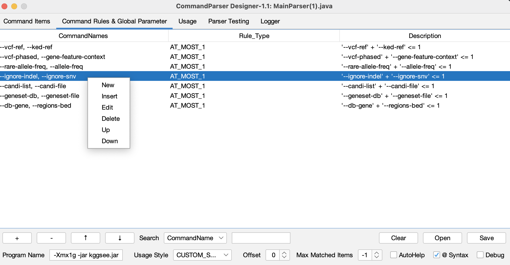

# Management Command Rule {#管理参数规则}

Add command rules between command items to the `Command Rules & Global Parameter` tab. Click the right mouse button in the blank area of the command rule panel or select the command rule to expand the management menu. The management menu contains the following six operations:

- **New:** create new command rule (shortcut: Ctrl + N).
- **Insert:** Insert a new command rule at the current location.
- **Edit:** Edit the command rule (shortcut: Double-click the command rule).
- **Delete:**Delete the command rule (shortcut: Ctrl + Delete).
- **Up:** Move the command rule up (shortcut: Ctrl + U).
- **Down:** Move the command rule dwon (shortcut: Ctrl + D).

In the lower menu bar, "+" corresponds to New, "-" corresponds to Delete, "↑" corresponds to Up, and "↓" corresponds to Down.

# Search Command Rule {#搜索参数规则}

In the search box (Ctrl + F) on the lower part of the command rule panel, set the search attribute (check box) and content (text box). Press Enter to search for the matched command rule.

# Edit Command Rule {#编辑参数规则}

When creating or editing a command rule, the command rule subpanel is displayed. Cannot set rules for "Help", "Request" type command items.

# Command Rule Type {#参数规则类型}

When command rule selects command items $$\{p_1,p_2,\cdots,p_n\}$$ , the meanings of command rule type are as follows:

| Command Rule Type  | Conditional Number | Description                               |
| :--------------------- | :--------: | :----------------------------------------------------- |
| AT_MOST                | $$k$$      | $$p_1,p_2,\cdots,p_n$$ can be specified with a maximum of $$k$$ items. |
| AT_LEAST               | $$k$$      | $$p_1,p_2,\cdots,p_n$$  should be specified with at least $$k$$ items. |
| EQUAL                  | $$k$$      | $$p_1,p_2,\cdots,p_n$$  should be specified with $$k$$ items. |
| MUTUAL_EXCLUSION | $$k$$      | $$p_1,p_2,\cdots,p_k$$  and $$p_{k+1},p_{k+2},\cdots,p_n$$ are not allowed to be used together. |
| SYMBIOSIS        | /    | $$p_1,p_2,\cdots,p_n$$  should be specified concurrently or not at all. |
| PRECONDITION | /    | When  $$p_j$$ is passed in，$$p_i (i<j)$$ should be passed in concurrently. |

