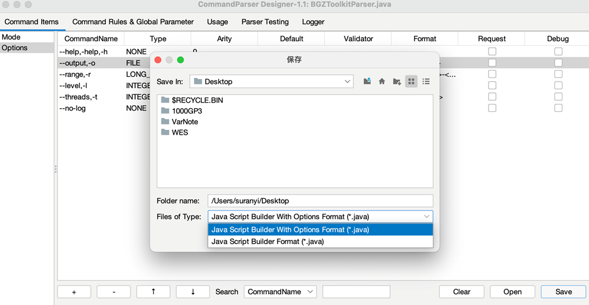

# Export to Java Script

On the `Command Items` tab or the `Command Rules & Global Parameter` tab, click the `Save ` button at the right corner below to save the current parser (global shortcut: Ctrl + S). Two formats for saving are available:

- **Java Script Builder With Options Format:** Single instance of parser and the creation of java variables.
- **Java Script Builder Format:** Single instance of parser.



## Java Script Builder With Options Format

`Java Script Builder With Options Format` infers the variable name (camel naming) from the main command name of the command item, and sets the variable type according to the command type of the command item, without a  format conversion of variables. This format supports the following API methods:

| API                                          | Return Type    | Description                                                  |
| :------------------------------------------- | :------------- | :----------------------------------------------------------- |
| Parser options = Parser.parse(String[] args) | Parser         | Parser input command.                                        |
| Parser options = Parser.parse(File argsFile) | Parser         | Parser input command in file.                                |
| Parser.usage()                               | String         | Get parser's document.                                       |
| Parser.getParser()                           | CommandParser  | Get parser's object.                                         |
| parser.getOptions()                          | CommandOptions | Get parser's command item value's object.                    |
| options.commandName.value                    | T (Generics)   | Get command item value (When not passed in, value is default value) |
| options.commandName.isPassedIn               | boolean        | Whether this command item is passed in.                      |
| options.commandName.matchedParameter         | String         | The value of the parameters matched by this command item (in raw string format). |

Use the parser to bridge input parameters with business logic in the entry function:

```java
public static void main(String[] args) {
    if (args.length == 0) {
        System.out.println(HttpDownloaderParser.usage());
        return;
    }

    HttpDownloaderParser options = HttpDownloaderParser.parse(args);
    if (options.help.isPassedIn) {
        System.out.println(HttpDownloaderParser.usage());
        return;
    }

    try {
        HttpDownloader2.instance(args[0])
                .setOutputFile(options.output.value)
                .setThreads(options.threads.value)
                .setPrintLog(true)
                .setTempDir(options.tempDir.value)
                .setProxy(options.proxy.value)
                .setTimeOut(options.timeout.value)
                .clean(options.overwrite.isPassedIn)
                .download();
    } catch (IOException e) {
        logger.error("{}", e.getMessage());
    }
}
```

## Java Script Builder Format

`Java Script Builder Format` creates a single instance of the CommandParser, which achieves accessing the parameter information (value, whether it was passed in, captured value) by command names (any command name of the command item), and requires formatting when getting the values. This format supports the following API methods:

| API                                      | Return Type    | Description                                                  |
| :--------------------------------------- | :------------- | :----------------------------------------------------------- |
| Parser.parse(String[] args)              | CommandOptions | Parser input command.                                        |
| Parser.parse(FileargsFile)               | CommandOptions | Parser input command in file.                                |
| Parser.usage()                           | String         | Get parser's document.                                       |
| Parser.getParser()                       | CommandParser  | Get parser's object.                                         |
| options.get(commandName)                 | Object         | Get the command item's value (if not passed in, the value is the default value). |
| options.isPassedIn(commandName)          | boolean        | Whether this command item is passed in.                      |
| options.getMatchedParameter(commandName) | String         | The value of the parameters matched by this command item (in raw string format). |

Use the parser to bridge input parameters with business logic in the entry function:

```java
public static void main(String[] args) throws IOException {
    if (args.length == 0) {
        // 没有传入参数时, 打印文档
        System.out.println(HttpDownloaderParser.usage());
        return;
    }

    CommandOptions options = HttpDownloaderParser.parse(args);
    if (options.isHelp()) {
        // 传入 help 指令时, 打印文档
        System.out.println(HttpDownloaderParser.usage());
        return;
    }

    // 业务逻辑
    try {
        HttpDownloader.instance(args[0])
                .setOutputFile((File) options.get("--output"))
                .setThreads((int) options.get("--threads"))
                .setPrintLog(!options.isPassedIn("--no-log"))
                .setTempDir((File) options.get("--temp-dir"))
                .setProxy((String) options.get("--proxy"))
                .setTimeOut((int) options.get("--time-out"))
                .clean(options.isPassedIn("--overwrite"))
                .download();
    } catch (IOException e) {
        logger.error("{}", e.getMessage());
    }
}
```

