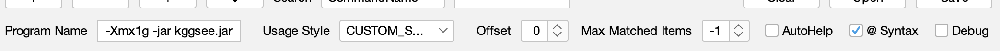
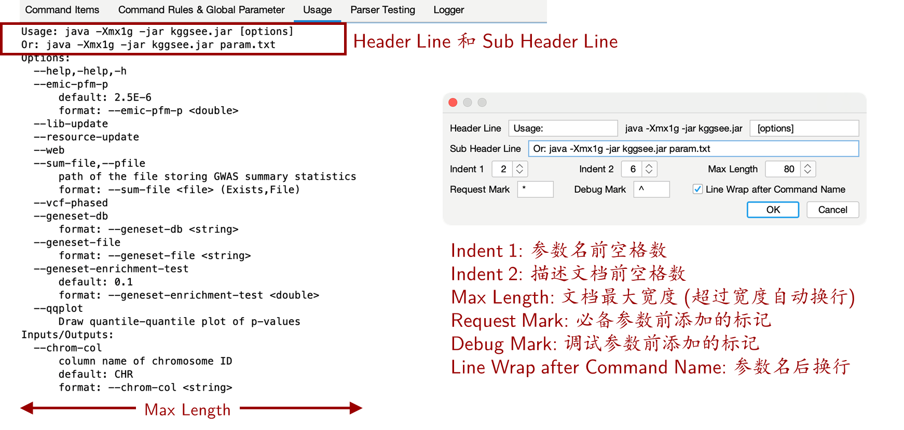

# Set Global Property

Set the global properties for CommandParser in `Command Rules & Global Parameter` tab. Global properties include followings options:

- **Program Name**

- **Usage Style:** The format of automatic document. Double click the check box may help to edit format, and choose "..." will help to create a new document format.

- **Offset:** offset of input commands.

  - Skip the first `offset` commands of the input commands.

  - ```
    # when offset = 3, the following commands will skip the first three parameter and parse "--level 5 -t 4 -o ~/test.gz"
    bgzip compress <file> --level 5 -t 4 -o ~/test.gz
    ```

- **Max Matched Items:** Set the maximum number of matched command items, 0 and -1 indicates no limitation.

  - When reaching the maximum number of command items, the subsequent commands are no longer parsed, and will be regarded as the parameter value of the last matched command item.

  - ```
    # when maxMatchedItems = 1, the following commmands only matched "bgzip" and following parameters, "compress <file> decompress <file>",  will be regarded as the value of "bgzip"
    bgzip compress <file> decompress <file>
    ```

- **AutoHelp:** When no parameter is passed in, add "help" parameter automatically.

- **@Syntax:** `@` Grammar switch

  - Under `@` grammar, the parameter will be replaced by file content if“@file”exist.

  - ```
    # If the file content is:  compress <file> --level 5 -t 4, the following two commands will have the same results.
    bgzip @file -o ~/test.gz
    bgzip compress <file> --level 5 -t 4 -o ~/test.gz
    ```

- **Debug:** Debug model switch. The command items tagged with "Debug" will only be shown and used in debug mode.



# Setting the format of automated documents

On the `Command Rules & Global Parameter` tab, double click the `Usage Style` check box or drop down to select `...` , and open the editor for document format. The format editor is used to control the automated document format in the `Usage` tab (as shown on the left), where users can implement copy and search (Ctrl + F).

