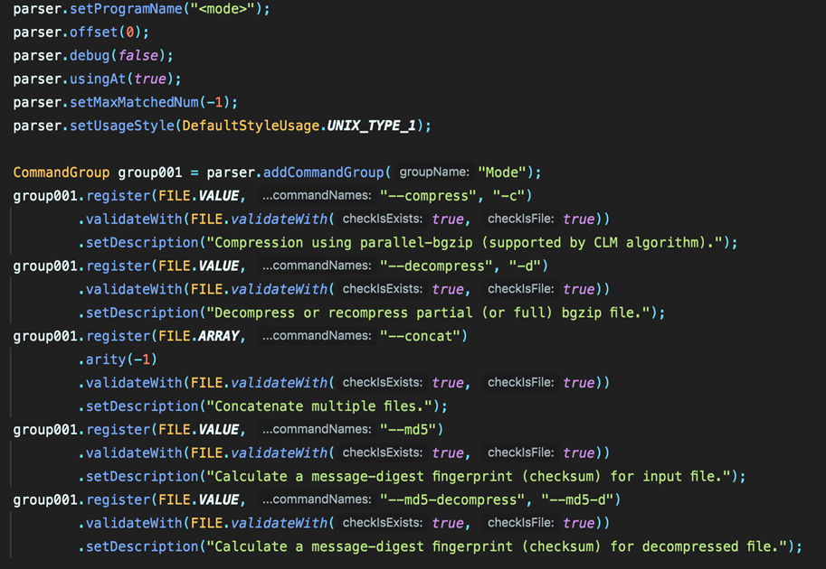

# Modify the Parser File

The exported parsing file is the Java source code (as shown in the following figure). Users can modify the Java source code directly to modify the parser. In addition, users can also import the source file to the graphical interface designer for reediting (drag the file to the interface window, click the Open button, or the shortcut: Ctrl + O).

CommandParserDesigner helps to compile the source code to a class file dynamically and obtains the parser object by `.getParser()`. Finally, the graphical interface designer will reproduces the parser based on the class member's information of the parser object.

