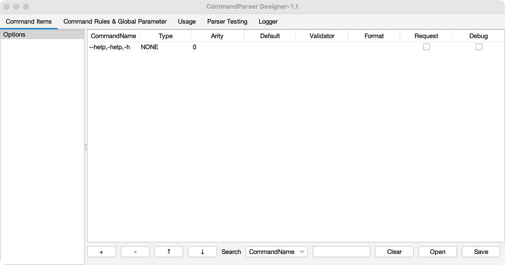
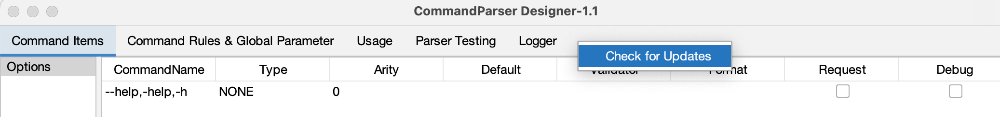
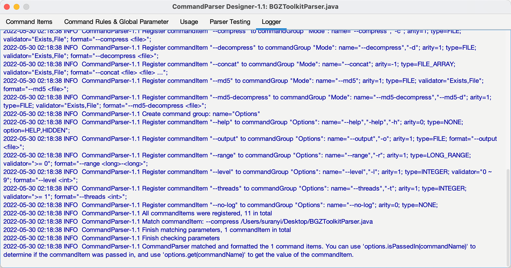
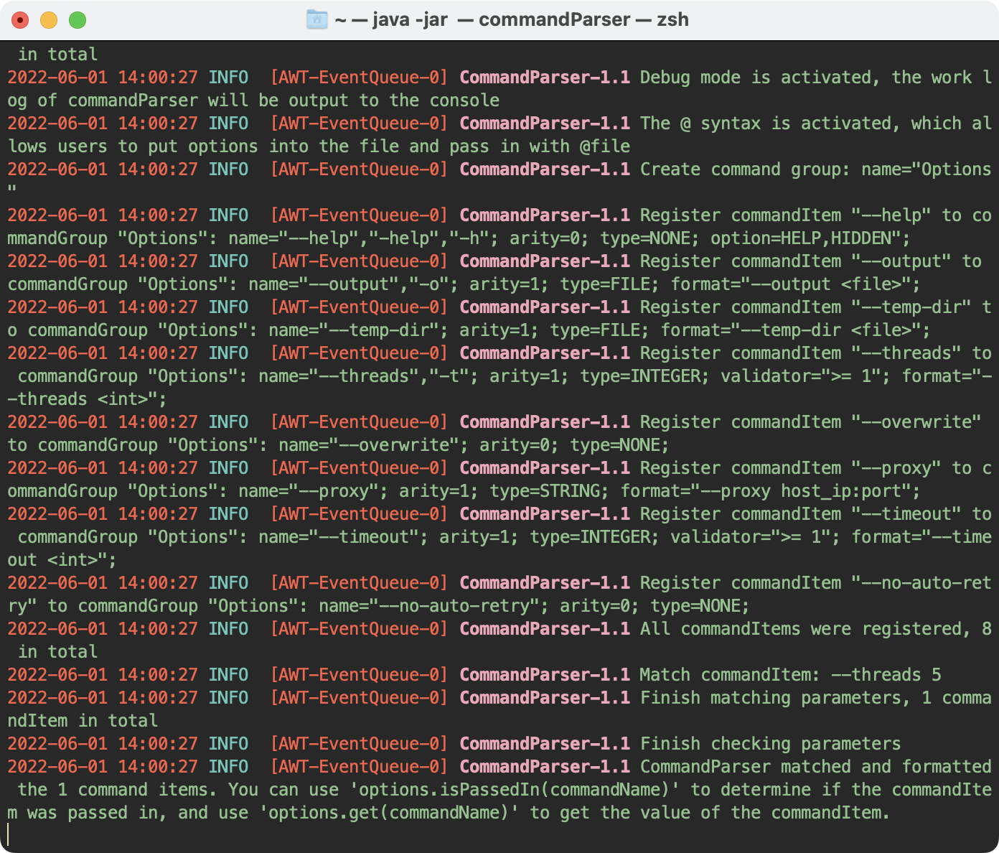

# Launch Software {#启动设计器图形界面}

Input  `java -jar ./commandParserDesigner-1.1.jar` command in terminal or double click software will start the graphics software.



> [!TIP|label:Set shortcut command]
>
> Macos or Unix systems can use the following to set `java -jar . /commandParserDesigner-1.1.jar` as a shortcut command.
>
> ```bash
> # open enviorment variation file
> vim ~/.zshrc
> 
> # add alias (${path} is "commandParserDesigner-1.1.jar"'s' abosulotely path)
> alias commandParser="java -jar ${path}"
> 
> # Click Esc, input ":x" and button "Enter", sava and quit this file
> source ~/.zshrc
> ```

# Check For Updates

Click the right mouse button on the tab bar to expand the menu. Clicking "Check for Updates" will Check whether `Command Parser` and `Command Parser Designer` have new version.



# View Logbook

In the `Logger` tab, you can view the work log of the current program, which is built based on log4j + Logback.

> [!DANGER|label:Command Parser Designer is only used as single software]
>
> Redirecting logs to the JSwing panel requires launching the GUI interface before the logging system loads. So when you import commandParserDesigner.jar used as package, whether or not take the initiative to call a graphical interface, GUI components will be loaded.



When starting from the terminal, log messages are also displayed at the terminal (if the terminal does not support this character set, it will display garbled characters):

