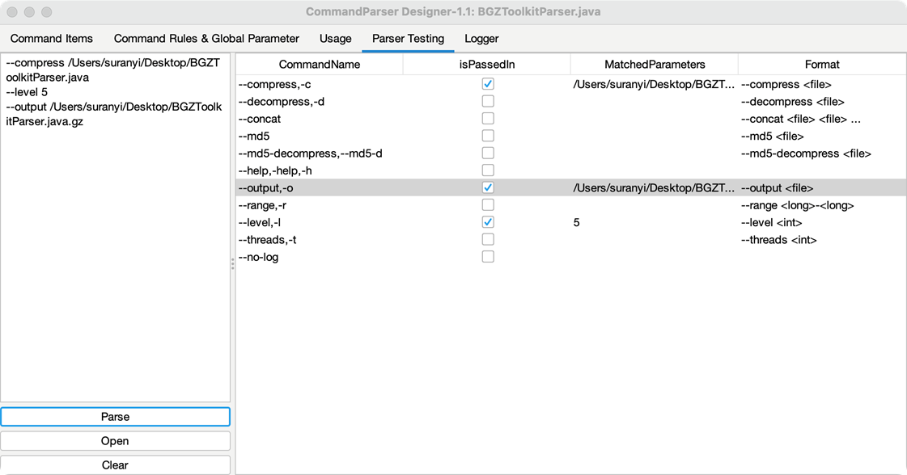

# Parse Parameter Experiment

Parse parameter experiment can be done in `Parser Testing` blank. Debug model will show more specific log. Input parameters in edit frame and click `Parse` button, the result of the parsing of all command items for the parameters will be displayed in the right panel:

- **isPassedIn:** Whether the command item is passed in.
- **MatchedParameters:** The input parameters matched to this command item.
- **Format:** The format of this command item matching the parameters.

Double click command item will skip to the command item position of `Command Items` panel.

