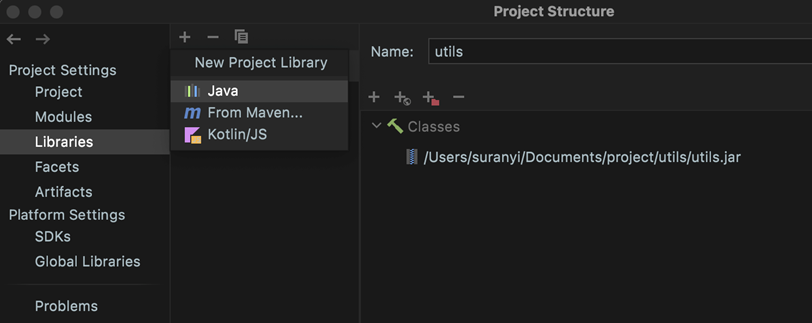
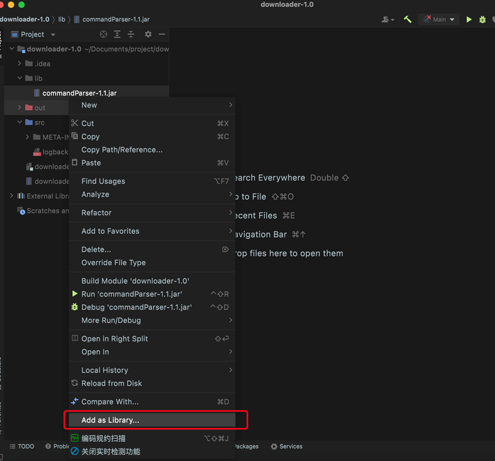
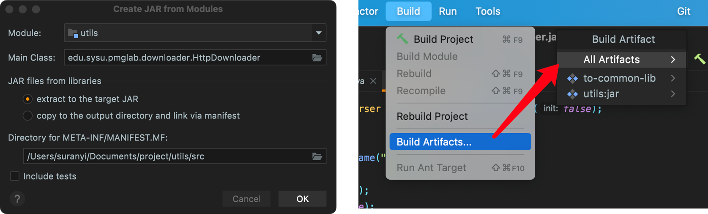

# Import CommandParser.jar

**Method 1 :** Select Libraries in Project Structure and add commandParser-1.1.jar.

**Method 2:** Create a lib folder in your project, add the package of commandParser-1.1.jar, and right-click "Add as Library...".

# Create  Jar Package

The command-line program development will be completed after creating the parser's source file, importing the commandParser-1.1.jar package, and writing the entry function (main class). Finally, package the Java project as a JAR package (take IDEA as an example):

Click: "Project Structure"... > "Artifacts" > "+" > "JAR" > "From modules with dependencies...". The left image is then displayed. Select the location of the entry function in Main Class, and click "OK". Finally, click "Build" > "Build Artifacts" to build a JAR package.

