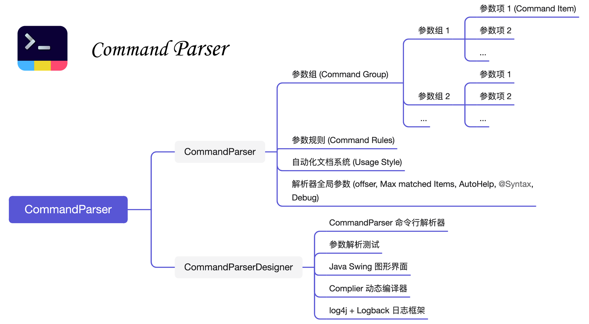

# Command Parser 简介

CommandParser 是一个基于 Java 平台开发的轻量级框架，用于快速地开发、解析、管理命令行参数。它提供了一个基本的图形界面 (CommandParserDesigner)，用于可视化地管理、编辑命令项目。

CommandParser 具有如下优点:

- 跨平台: 基于 Java8 开发，所有软件库均为标准库，能够在广泛的设备及 JDK 版本中运行；
- 图形化设计: commandParserDesigner-1.1.jar 提供了友好的图形化设计与管理功能，帮助开发者轻松预览、管理具有成百上千参数项的解析器；图形化设计的解析器可以直接导出 Java 脚本文件运行；
- 脚本设计: CommandParser 支持纯脚本开发，链式调用完成参数项注册；脚本文件也可以导入图形化设计程序进行可视化编辑、管理；
- 轻量级: commandParser-1.1.jar 仅 400+ KB，无外部依赖；核心程序包与图形界面程序分离，减小包大小；
- 单行解析: 通过 `Parser.parse(...)` 完成字符串数组或文件的解析;
- 自动化文档及高度可定制化: 自动化文档几乎满足所有的文档设计需求，开放接口设计允许用户自定制文档风格；
- 支持指令集之间的预定规则: 在解析阶段完成指令互斥、依赖关系的校验，减少额外代码量；
- 开发模式: 允许调试参数与用户参数在同一个脚本文件中进行开发，互不干扰。

> [!COMMENT|label:联系开发者]
> 张柳彬, suranyi.sysu@gmail.com

# 致谢

- 感谢袁杨杨博士在本项目开发过程中的帮助，包括功能性测试、文档翻译及修订。

- 感谢李淼新教授对本项目图形界面交互提出的若干意见。

- 感谢彭文杰同学为本项目提供了第一版翻译稿。
