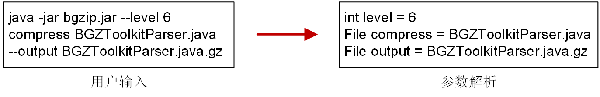

# 命令行界面

**命令行界面 (Command-line interface, CLI)** 是一种基于文本的用户界面，用于运行程序、管理计算机文件以及与计算机交互。命令行界面与软件图形界面、Web 服务一样，都是用于实现程序操作的内部形式与人类可以接受的形式之间的转换。通常，命令行界面接受用户键盘输入的指令，并将指令解析为不同程序运行时的参数或设置，最终发起后端的计算任务。

在 Java 中将程序封装为可运行的 jar 包，能够方便不同平台之间传输、使用，不需要考虑 IDE 环境而进行繁琐的配置。通常 jar 包就包含了完成一套计算/分析/服务所需的全部代码，为了让 jar 包可以根据不同的输入参数执行不同的任务，需要对命令行进行高效地解析，而有效的命令行解析工具有助于提升开发效率、用户交互体验等。

