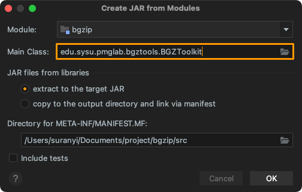

# BGZToolkit {#项目概述}

BGZIP 是生物信息学领域的常用压缩工具，它将输入文件切分成近似 64KB 的小块，并单独应用 Deflater 压缩成一系列小的 BGZF 块，这使得可以针对压缩后的块构建索引信息，并用于快速地检索部分数据，而无需解压整个文件。

本项目使用纯 Java 脚本开发 BGZ 文件的操作方法，包括并行压缩、解压、拼接、文件校验等功能。


| 资源类型       | 路径                                                        |
| :------------- | :---------------------------------------------------------- |
| **软件包**     | http://pmglab.top/commandParser/bgzip/bgzip.jar             |
| **源代码**     | http://pmglab.top/commandParser/bgzip/BGZToolkit.java       |
| **解析器文件** | http://pmglab.top/commandParser/bgzip/BGZToolkitParser.java |

# API 方法 {#API-方法}

BGZIP 的主要 API 方法可以在 edu.sysu.pmglab.bgztools.BGZToolkit 中找到 (现已集成在 commandParser 包中)，分别为:

- **压缩文件:** BGZToolkit.Compress.instance(File inputFile, File outputFile)
  - 设置并行压缩线程数: .setThreads(int nThreads)
  - 设置压缩的文件范围: .limit(long start, long end)
  - 设置压缩级别: .setCompressionLevel(int compressionLevel)
- **提取文件:** BGZToolkit.Extract.instance(File inputFile, File outputFile)
  - 设置并行压缩线程数: .setThreads(int nThreads)
  - 设置读取的文件范围: .limit(long start, long end)
  - 设置输出文件格式: .setOutputParam(BGZOutputParam outputParam)
- **计算文件的 MD5 码:** BGZToolkit.MD5.instance(File inputFile)
  - 是否计算解压后文件的 MD5 码: .setDecompression(boolean decompression)
- **连接多个子文件:** BGZToolkit.Concat.instance(File[] inputFiles, File outputFile)

实例化任务完成后, 通过 .submit() 提交相应的任务.

# 根据 API 设计解析器 {#根据-API-设计解析器}

BGZIP 工具集共有 5 个独立运行模式: 压缩、解压、连接、MD5 检查、MD5 检查 (解压信息)，总共有包括线程数、文件指针范围、输出文件、压缩级别、是否打印日志在内的 5 个参数。创建步骤如下:

**Step1:** 创建参数组：Mode 组, Options 组;

**Step2:** 创建 Mode 组参数: --compress; --decompress; --concat; --md5; --md5-decompress；

**Step3:** 创建 Options 组参数: --output; --range; --level; --threads；

**Step4:** 设定参数规则: 

- Mode 组参数 --compress; --decompress; --concat; --md5; --md5-decompress 必须传入一个；
- 选定了 --md5 或 --md5-decompress 模式时, 无法使用 --output; --range; --level; --threads 参数；
- 选定了 --concat 模式时, 无法使用 --range; --level; --threads 参数；

**Step5:** 设定程序名为: `<mode>`；

**Step6:** [导出 Java Script Builder With Options Format 格式文件](http://pmglab.top/commandParser/bgzip/BGZToolkitParser.java)。

# 设计主函数 {#设计主函数}

使用 CommandParser 桥接用户参数与业务逻辑，将该文件命名为 [BGZToolkit.java](http://pmglab.top/commandParser/bgzip/BGZToolkit.java):

```java
public static void main(String[] args) {
    try {
        BGZToolkitParser options = BGZToolkitParser.parse(args);
        if (options.getOptions().isHelp()) {
            System.out.println(BGZToolkitParser.usage());
            return;
        }

        if (options.compress.isPassedIn) {
            // 压缩文件
            long startTime = System.currentTimeMillis();
            File outputFile = options.output.isPassedIn ? options.output.value : options.compress.value.addExtension(".gz");
            Compress task = Compress.instance(options.compress.value, outputFile)
                    .setThreads(options.threads.value)
                    .setCompressionLevel(options.level.value)
                    .setPrintLog(true);

            if (options.range.isPassedIn) {
                task.limit(options.range.value[0], options.range.value[1]);
            }
            task.submit();
            logger.info("Compression completed. Total time: {} s; File size: {}", (System.currentTimeMillis() - startTime) / 1000d, outputFile.formatSize(3));
            return;
        }

        if (options.decompress.isPassedIn) {
            long startTime = System.currentTimeMillis();

            // 解压文件
            File outputFile;
            Extract task;
            if (options.output.isPassedIn) {
                outputFile = options.output.value;

                task = Extract.instance(options.decompress.value, outputFile)
                        .setThreads(options.threads.value);

                if (options.level.isPassedIn || options.output.value.withExtension(".gz")) {
                    task.setOutputParam(new BGZOutputParam(options.level.value));
                }
            } else {
                if (!options.level.isPassedIn) {
                    // 没有传入 level 时, 认为是解压文件
                    outputFile = options.decompress.value.changeExtension("", ".gz");
                    if (outputFile.equals(options.decompress.value)) {
                        logger.error("can't remove an extension from {} -- please rename", options.decompress.value);
                        return;
                    }
                } else {
                    // 传入了 level, 认为是提取文件子集
                    if (options.decompress.value.withExtension(".gz")) {
                        logger.error("missing required positional argument: --output");
                        return;
                    } else {
                        outputFile = options.decompress.value.addExtension(".gz");
                    }
                }

                task = Extract.instance(options.decompress.value, outputFile)
                        .setThreads(options.threads.value);
            }

            if (options.range.isPassedIn) {
                task.limit(options.range.value[0], options.range.value[1]);
            }

            task.submit();

            logger.info("Decompression completed. Total time: {} s; File size: {}", (System.currentTimeMillis() - startTime) / 1000d, outputFile.formatSize(3));
            return;
        }

        if (options.concat.isPassedIn) {
            // 连接文件
            long startTime = System.currentTimeMillis();
            if (!options.output.isPassedIn) {
                logger.error("missing required positional argument: --output");
                return;
            }

            Concat.instance(options.concat.value, options.output.value).submit();

            logger.info("Concat completed. Total time: {} s; File size: {}", (System.currentTimeMillis() - startTime) / 1000d, options.output.value.formatSize(3));
            return;
        }


        // md5 校验文件
        if (options.md5.isPassedIn) {
            MD5 task = MD5.instance(options.md5.value);
            task.setDecompression(false);
            System.out.println("MD5 (" + options.md5.value + ") = " + task.submit());
            return;
        }

        if (options.md5Decompress.isPassedIn) {
            MD5 task = MD5.instance(options.md5Decompress.value);
            task.setDecompression(true);
            System.out.println("MD5 (" + options.md5Decompress.value + ") = " + task.submit());
            return;
        }
    } catch (Exception | Error e) {
        logger.error("{}", e.getMessage(), e);
    }
}
```

# 创建 jar 包 {#创建-jar-包}

依次点击: Project Structure… > Artifacts > + > JAR > From modules with dependencies …, 在 Main Class 处选择入口函数位置，并打包为 [bgzip.jar](http://pmglab.top/commandParser/bgzip/bgzip.jar):



进入 `bgzip.jar` 所在路径，在控制台输入指令显示文档: 

```shell
java -jar bgzip.jar
```


# 应用 BGZToolkit {#应用-BGZToolkit}

## 1. 多线程压缩单个文件

```bash
# 文件来源: http://pmglab.top/genotypes/#/
java -jar bgzip.jar -c ~/Desktop/1000GP3/AMR/1kg.phase3.v5.shapeit2.amr.hg19.chr1.vcf -l 5 -t 8
```


## 2. 解压单个文件，并重新压缩为 bgzip 格式

```bash
# 提取前 1 GB 内容
java -jar bgzip.jar -d ~/Desktop/1000GP3/AMR/1kg.phase3.v5.shapeit2.amr.hg19.chr1.vcf.gz \
--range 0-1073741824 -o ~/Desktop/subFile.vcf.gz

# 解压上述文件
java -jar bgzip.jar -d  ~/Desktop/subFile.vcf.gz
```

## 3. 检验文件 MD5 码

```bash
# 结果: 29ccebe9d2748328f6cc8b16c6563261
java -jar bgzip.jar --md5 ~/Desktop/subFile.vcf

# 结果: 29ccebe9d2748328f6cc8b16c6563261
java -jar bgzip.jar --md5-d ~/Desktop/subFile.vcf.gz
```

## 4. 连接多个文件

```bash
# 先拆分出 2 个文件
java -jar bgzip.jar -d ~/Desktop/1000GP3/AMR/1kg.phase3.v5.shapeit2.amr.hg19.chr1.vcf.gz \
--range 0-536870912 -o ~/Desktop/subFile1.vcf.gz
java -jar bgzip.jar -d ~/Desktop/1000GP3/AMR/1kg.phase3.v5.shapeit2.amr.hg19.chr1.vcf.gz \
--range 536870912-1073741824 -o ~/Desktop/subFile2.vcf.gz

# 拼接两个子文件
java -jar bgzip.jar --concat ~/Desktop/subFile1.vcf.gz ~/Desktop/subFile2.vcf.gz -o ~/Desktop/subFile.merge.vcf.gz

# 校验 md5 码, 结果: 29ccebe9d2748328f6cc8b16c6563261
java -jar bgzip.jar --md5-d  ~/Desktop/subFile.merge.vcf.gz   
```

