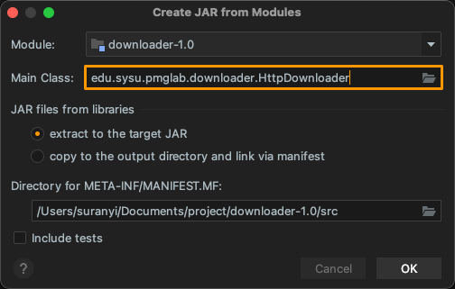
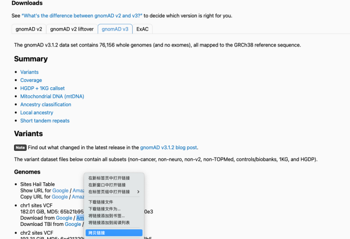

# HttpDownloader {#项目概述}

生物信息学/医学信息学研究需要大量的公共数据资源支撑。然而，这些资源由于其数据量庞大（例如，dbNSFP 数据库达到 30 GB 以上，GnomAD 数据库达到 1TB 以上），在下载时伴随着诸多问题（例如重定向跳转、云端限速、断点续传等）。为了简化这些数据库的下载、更新流程，以及有效地将该流程作为 API 工具整合至其他的公共项目 (这里主要针对 Java 开发)，我们开发了HttpDownloader。此外，对于 FTP 的下载支持正在计划中。

HttpDownloader 是基于 Java 平台开发的简易 Http 下载器，旨在提升基础的资源下载功能。目前支持：断点续传、根据响应头的 Location 进行 URL 重定向、并行下载（需要服务器支持 chunked 或者发送分段请求后获得 206 响应码）、动态获取文件大小的资源下载、代理、迅雷链接下载。

| 资源类型       | 路径                                                         |
| :------------- | :----------------------------------------------------------- |
| **软件包**     | http://pmglab.top/commandParser/downloader/downloader-1.0.jar |
| **源代码**     | http://pmglab.top/commandParser/downloader/HttpDownloader.java |
| **解析器文件** | http://pmglab.top/commandParser/downloader/HttpDownloaderParser.java |

# API 方法 {#API-方法}

HttpDownloader 的主要 API 方法可以在 edu.sysu.pmglab.downloader.HttpDownloader 中找到 (现已集成在 CommandParser 包中)，分别为:

- 下载文件: HttpDownloader.instance(String url)
  - 设置并行下载线程数: .setThreads(int nThreads)
  - 设置输出文件名: .setOutputFile(File outputFile) 和 .setOutputFile(String outputFileName)
  - 设置临时文件夹: .setTempDir(File tempDir) 和 .setTempDir(File tempDirName)
  - 设置代理: . setProxy(String host, String port) 和 .setProxy(String hostPort)
  - 设置最长等待时间 (单位: 秒): .setTimeOut(int timeOut)
  - 清除缓存数据: .clean(boolean clean)

实例化任务完成后，通过 `.download()` 执行下载任务。

# 根据 API 设计解析器 {#根据-API-设计解析器}

HttpDownloader 的第一个参数识别为 URL 地址, 从第二个参数开始解析为参数项, 设定 offset=1. 解析器创建步骤如下:

**Step1:** 创建参数组：Options 组；

**Step2:** 创建 Options 组参数: --output; --temp-dir, --threads, --overwrite, --proxy, --time-out, --no-auto-retry；

**Step3:** 设定程序名为: `<URL>`，偏移量 offset 为: 1；

**Step4:** 设定 Usage Style 为 Unix_Style_3，并设置子标题信息如下:


**Step5:** [导出 Java Script Builder With Options Format 格式文件](http://pmglab.top/commandParser/downloader/HttpDownloaderParser.java)。

# 设计主函数 {#设计主函数}

使用 CommandParser 桥接用户参数与业务逻辑，将该文件命名为 [HttpDownloader.java](http://pmglab.top/commandParser/downloader/HttpDownloader.java):

```java
public static void main(String[] args) {
    try {
        if (args.length == 0) {
            System.out.println(HttpDownloaderParser.getParser());
            return;
        }

        HttpDownloaderParser parser = HttpDownloaderParser.parse(args);
        if (parser.help.isPassedIn) {
            System.out.println(HttpDownloaderParser.getParser());
            return;
        }

        do {
            try {
                HttpDownloader.instance(args[0])
                        .setOutputFile(parser.output.value)
                        .setThreads(parser.threads.value)
                        .setPrintLog(true)
                        .setTempDir(parser.tempDir.value)
                        .setProxy(parser.proxy.value)
                        .setTimeOut(parser.timeout.value)
                        .clean(parser.overwrite.isPassedIn)
                        .download();
            } catch (IOException e) {
                logger.error("{}", e.getMessage());

                if (!parser.noAutoRetry.isPassedIn) {
                    logger.error("Download failed, resume download in 3 seconds.");

                    Thread.sleep(3000);
                    continue;
                }
            }

            break;
        } while (true);
    } catch (Exception | Error e) {
        logger.error("{}", e.getMessage());
    }
}
```

# 创建 jar 包 {#创建-jar-包}

依次点击: Project Structure… > Artifacts > + > JAR > From modules with dependencies …, 在 Main Class 处选择入口函数位置，并打包为 [downloader-1.0.jar](http://pmglab.top/commandParser/downloader/downloader-1.0.jar):



进入 `downloader-1.0.jar` 所在路径，在控制台输入指令显示文档: 

```shell
java -jar downloader-1.0.jar
```


# 应用 HttpDownloader {#应用-HttpDownloader}

## 1. [gnomAD](https://link.zhihu.com/?target=https%3A//gnomad.broadinstitute.org/downloads) 数据库下载

Genome Aggregation Database (简称gnomeAD)是由各国研究人员共同协作建立的一个基因组突变频率数据库，该数据库的目的是汇集和协调不同级别的大规模测序项目，包括全外显子与全基因组数据，为广泛的科学研究community汇总数据。目前该数据库包括125748个全外显子数据与15708个全基因组数据 （v2版本），这些数据来源于各自不同的疾病研究项目与大型人口种群测序项目。该数据库包括之前常用的千人基因组数据、ESP数据库及绝大部分的ExAC数据库。

Amazon 的链接支持并行下载和断点续传，无需代理。



```shell
java -jar ./downloader-1.0.jar https://gnomad-public-us-east-1.s3.amazonaws.com/release/3.1.2/vcf/genomes/gnomad.genomes.v3.1.2.sites.chr1.vcf.bgz -o ~/Desktop 
```


## 2. [dbNSFP](https://sites.google.com/site/jpopgen/dbNSFP) 数据库下载

dbNSFP是一个用于对人类基因组中所有潜在的非同义单核苷酸变异（nsSNV）进行功能预测和注释的数据库。其当前版本基于Gencode版本29/Ensembl版本94，包括总共84,013,490个nsSNV和ssSNV（拼接点SNV）。它汇编来自32个突变效应预测算法（包括SIFT、SIFT、SIFT4G、Polyphen2-HDIV、Polyphen2-HVAR、LRT、MutationTaster2、MutationAssessor、FATHMM、MetaSVM、MetaLR、MetaRNN、CADD、CADD_hg19、VEST4、PROVEAN、FATHMM-MKL、FATHMM-XF、fitCons x 4、LINSIGHT、DANN、GenoCanyon、Eigen、Eigen-PC、M-CAP、REVEL、MutPred、MVP、MPC、PrimateAI、GEogen2、BayesDel_addAF、BayesDel_noAF、ClinPred、LIST-S2、ALOFT）的功能性预测结果、9个保守性评分（如GERP++_RS、phyloP100way、phastCons100way、bStatistic等）和其他各类突变水平和基因水平的注释信息（如等位基因频率、在ClinVar中的对应信息、基因表达、基因相互作用信息等）。


```shell
java -jar ./downloader-1.0.jar https://dl2.boxcloud.com/d/1/b1\!XancTvwk7LlsYg9p6aRo-sxtzNi73B978Cn0D_ZLbgPY78iR4ZVnMt4k2mG3O7f6OKK7QSiv0--ZRoDnXSspMdJeJtvWgU2HFHL86wDUL4BAi7uXH2qpsJ-6u7mTwOqubNoh2ytZkqtMvw-V9VWFkZ5WBGbJyJ6BOPRfjsq6XD5vu3U1YUNYJLpOUzDfQhsBCmstp7hSUS8H-dhaUEL6ldH_mKMANcQLyVSboZkXQAbkoT_ICbUzQW_fKTqJF496kKyXEROkaYveQxWjI0h00O-FYT451_f2gxkxLQXcWCOQkTJ1jCgeFi_5LYSrCVfNQMpAoVedBAJwIuFTSKBDG1YO4JFDlCHmT_O00fYEpbP3L5-7HdR_qo0iwZEa3oVq8K_za7rIiCc7aw4SATOxGYg1V_h7qI0xWEgHry76vyutyu8JTd3rrsJE_0YwyQMrBh8a2BkvCS-0g_YHdRz82Ov8Zt3bcG4tk_EWhAPicBBz_KB8RYm_boobyXzgbVN55XKHk5Kt13xYYTGK3E855DrSq_ypxfx_qXZyeZQOSQuV6capn_eT-iuSzTwin8jRNMb0t8uKFDRV9RE1UtF3vc3UfI6vopvSUp737H3wQL2cYwKQh2axeYvHHRPbRnp4Gz2uShcVsiayIl5QzJxnhuesLkfuyK7iT5phQX_eDzzVuHsZS5dc9BEivr-Y_Pt7pDPRGFtkFwug1pILMu_LyGS-9fE1Q3xFgVJXRVnOTnXYzBPdiYoSaOG_RaMiv3zNKsdDso-o4a2EM4e8V2x2JTC52k8Ov6fDMp0WPxjKaF56i6qZoYbYXFdBMKSL4bZvfXTCL-vqkg7n9GpHQig0XrkJmdNke2CXOmPsHiTalxg6qF9dg441hBeUY6wGRAj1tcw4VGV3SlIMOl2H0ZV_353P9tostSh_3EOm7Z0kitxJs0UOsI3vMgfPoW0MF-XnifvWgiM-ogqPr9ihV0Azixuou5aRqfSUF3k8zyvwPl2WXt_EwfZiTMBSQI8tzBISt4NdAs6LIDccrPRUARIAqOAOx9kqmLAy-yqdERaqYYcMHl7jKd3unPcI31BFRm2OL5FLaeShJz1oSiOiHTmgoUQR0W9jicpnKERcXUNKi6hOurquu6ciNGbWZIc0cO9O8WTxadzYVFqDvTYiPgfinZPozVQrzml-JPylv5HiozmvGp12052k6HArP4fTOIUHQjT_qSa8-CzaTAVIbzDyB7fqFtTxsX_diAe6LfHkl2C8VnZ18pSEWtkICzNWidagPBENXtp9yAL8l_3X_p4R0hH7FfV5a5FmS5LfhRkmcEXj1lP4FokZyEWnYgv4OZ9R3CDble-IKfjWnWHTy8APjbyOuPm4zC7fklpoSJvfSltVcAxwMY9l7LIqCsvW5m4./download -o ~/Desktop/dbNSFP4.3a.zip
```


