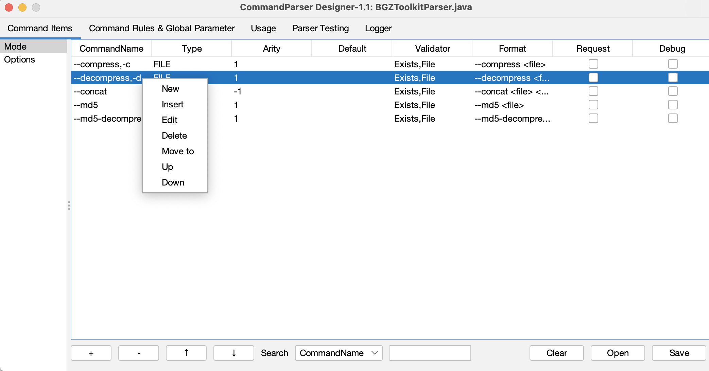
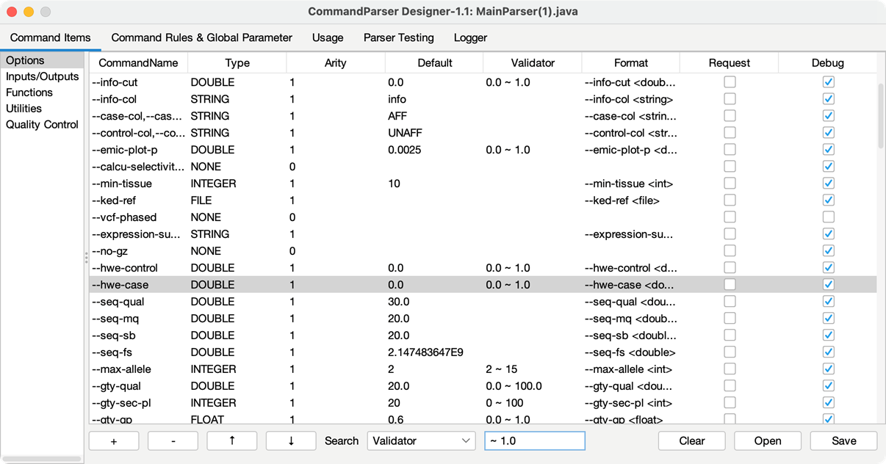

# 管理参数组 (Command Group) {#管理参数组}

通常按照参数的功能或属性可以将参数项粗分为几个大类，这个 “大类” 就是参数组。在 CommandParser 中，参数组是组织参数的基本单位。解析器初始化时，默认创建参数组 `Options`，以及该参数组中的第一个参数 `--help, -help, -h`，用于呼出帮助文档。

在 `Command Items` 标签页中，左侧为参数组面板。在参数组面板空白处或选中参数组点击鼠标右键，展开管理菜单。管理菜单包含以下 7 种操作:

- **New:** 创建新参数组
- **Insert:** 在当前位置插入新参数组
- **Delete:** 删除该参数组
- **Merge to:** 将该参数组合并至其他参数组
- **Up:** 上移该参数组
- **Down:** 下移该参数组
- **Rename:** 重命名参数组

参数组的顺序会影响自动化文档输出时的显示顺序:

# 管理参数项 (Command Item) {#管理参数项}

在 `Command Items` 标签页中，右侧为参数项面板。在参数项面板空白处或选中参数项点击鼠标右键，展开管理菜单。管理菜单包含以下 7 种操作:

- **New:** 创建新参数项 (快捷键: Ctrl + N)
- **Insert:** 在当前位置插入新参数项
- **Edit:** 编辑该参数项 (快捷键: 双击参数项)
- **Delete:** 删除该参数项 (快捷键: Ctrl + Delete)
- **Merge to:** 将该参数项移动至其他参数组
- **Up:** 上移该参数项 (快捷键: Ctrl + U)
- **Down:** 下移该参数项 (快捷键: Ctrl + D)

下方菜单栏 “+” 对应 New 操作，“-” 对应 Delete 操作，“↑” 对应 Up 操作，“↓” 对应 Down 操作

# 搜索参数项 {#搜索参数项}

参数项面板下方搜索框处 (快捷键 Ctrl + F)，设置搜索的属性 (复选框) 及内容 (文本框)，按回车键查找符合的参数项并进行跳转、高亮显示。搜索内容忽略大小写.

# 编辑参数项 {#编辑参数项}

解析器的工作单位是 “参数项”，它声明了在海量词汇、符号组合中哪些字段是关键字？它之后有多少个参数是它的值？它捕获的值应该如何转为 Java 对象？它捕获的值进行什么样的检验？

新建或编辑参数项时，弹出参数项子面板，子面板有 12 个参数属性。`Command Name` 和 `Command Type` 定义了该参数项的关键字和数据类型，为必须设置的属性:

其中，各个属性字段的含义如下:

| 参数属性                             | 描述                                                     |
| :--------------------------------------- | :----------------------------------------------------------- |
| Command Name 参数名                 | 1. 参数具有多个参数名时，使用逗号分隔 (如: --output,-o)，第一个参数名作为主参数名; 2. 参数名格式: 0-9a-zA-Z+-_; 3. 参数名输入完成后点击 check 按钮进行检查 (检查是否符合格式、是否重名)，通过检查后的参数才能设置其他属性和提交。 |
| Command Type [参数类型](#参数格式)  | 1. 内置 None (无类型，仅验证是否被传入), Boolean, Byte, Short, Integer, Long, Float, Double, String, File 10 种基本类型; 2. 数据类型派生 Value, Array, Set, Range 等类型。 |
| Validator [参数验证器](#参数验证器) | 不同参数类型可用的验证器种类不同 (文件验证器、数值验证器等)，详见[参数验证器](#参数验证器)。 |
| Default 默认值                      | 该默认值需要经过 Command Type 进行格式转换及 Validator 参数值验证，输入格式与 Format 和 Arity 定义的格式一致。 |
| Arity 参数长度            | -1 表示不确定的长度(可以是 0 个参数)，直到下一个匹配的命令项的所有参数都被认为是这个命令项的值。 |
| Format 参数的格式描述文档 | 默认根据参数类型进行设置 (通常为`主参数名 默认格式`)。       |
| Description 参数的描述文档          | 参数的描述文档。                                              |
| Help 是否识别为帮助指令             | 当标记为 Help 的参数项被传入时，解析器不会进行数值的格式转换和验证。 |
| Request 是否为必备参数              | 没有传入 Help 标记的参数时，标记为 Request 的参数项必须传入。 |
| Hidden 是否在文档中隐藏该指令       | 标记为 Hidden 的参数项不会在文档中显示。                      |
| Debug 该指令是否为调试指令          | 当解析器为`非 Debug 模式`时，标记为 Debug 的参数项将无法使用，相应的参数规则也会失效化，该参数项也不会在文档中显示。 |

# 参数类型输入格式 {#参数格式}

参数格式为: `主参数类型.派生参数类型`。主参数类型包括 IType.NONE (无类型，仅验证是否被传入), BOOLEAN, BYTE, SHORT, INTEGER, LONG, FLOAT, DOUBLE, STRING, FILE。派生参数类型包括以下 16 种类型。当类型被指定时，它被分配默认的格式文档 (i.e., `CommandName Format`)。带有 `...` 标记的类型可以使用 arity 控制捕获的参数的个数。

| Command Type 派生类型 | 默认格式 (Format)                   |
| :-------------------- | :---------------------------------------- |
| VALUE                 | value                                     |
| ARRAY                 | value value …                             |
| ARRAY_COMMA           | value,value,…                             |
| ARRAY_SEMICOLON       | value;value;…                             |
| SET                   | value value …                             |
| SET_COMMA             | value,value,…                             |
| SET_SEMICOLON         | value;value;…                             |
| MAP                   | key=value key=value …                     |
| MAP_COMMA             | key=value,key=value,…                     |
| MAP_SEMICOLON         | key=value;key=value;…                     |
| RANGE                 | value-value                               |
| LABEL_RANGE           | label:value-value label:value-value …     |
| LABEL_RANGE_COMMA     | label:value-value,label:value-value,…     |
| LABEL_RANGE_SEMICOLON | label:value-value;label:value-value;…     |
| LABEL_ARRAY           | label:value,value,… label:value,value,…   |
| LABEL_ARRAY_SEMICOLON | label:value,value,…;label:value,value,…;… |

# 参数验证器 (Validator) {#参数验证器}

不同类型的参数支持不同的验证器，如下所示:

| Command Type                                            | Validator 支持的类型                                         |
| :------------------------------------------------------ | :----------------------------------------------------------- |
| None, Boolean                                           | 不支持使用验证器。                                           |
| Byte, Short, Integer, Long, Float, Double 数值类型 | 数值范围验证器: 1. 范围 (包含边界值): 最小值 ∼ 最大值; 2. 指定最小值: ≥ 最小值。 |
| String 字符串类型                                  | 限定值验证器 (只能取指定的元素): 多个限定值使用空格分隔，Ignore Case 忽略大小写，Index Access 允许使用索引访问 (0 代表第一个限定值…)。 |
| File 文件类型                                      | 文件验证器 File Exists 文件路径必须存在; Single File 文件路径不能指向文件夹; Directory 文件路径必须指向文件夹; Inner Resource 优先识别当前运行环境资源 (允许访问 jar 包内部文件)。 |

