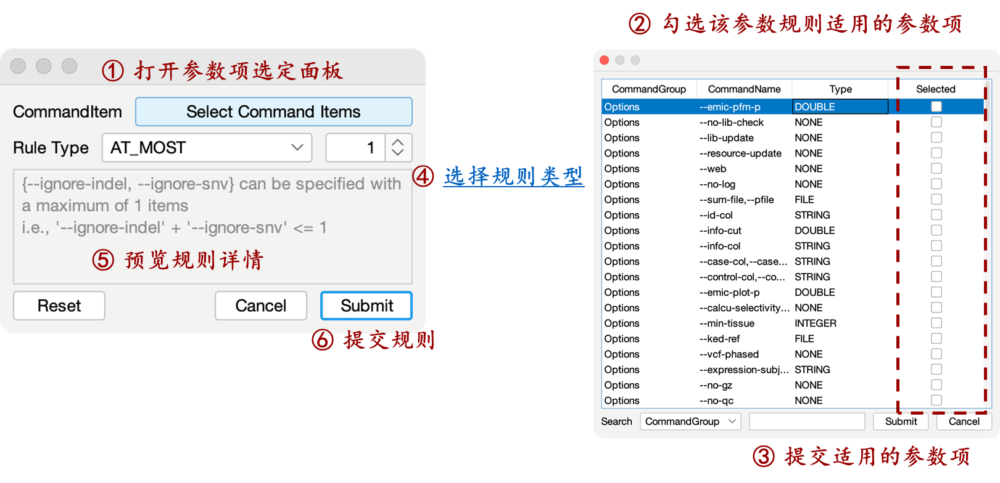

# 管理参数规则 (Command Rule) {#管理参数规则}

在 `Command Rules & Global Parameter` 标签页中添加参数间的指令规则。在参数规则面板空白处或选中参数规则点击鼠标右键，展开管理菜单。管理菜单包含以下 6 种操作:

- **New:** 创建新参数规则 (快捷键: Ctrl + N)
- **Insert:** 在当前位置插入新参数规则
- **Edit:** 编辑该参数规则 (快捷键: 双击参数规则)
- **Delete:** 删除该参数规则 (快捷键: Ctrl + Delete)
- **Up:** 上移该参数规则 (快捷键: Ctrl + U)
- **Down:** 下移该参数规则 (快捷键: Ctrl + D)

下方菜单栏 “+” 对应 New 操作，“-” 对应 Delete 操作，“↑” 对应 Up 操作，“↓” 对应 Down 操作

# 搜索参数规则 {#搜索参数规则}

参数规则面板下方搜索框处 (快捷键 Ctrl + F)，设置搜索的属性 (复选框) 及内容 (文本框)，按回车键查找符合的参数规则并进行跳转、高亮显示，搜索内容时忽略大小写。

# 编辑参数规则 {#编辑参数规则}

新建或编辑参数规则时，弹出参数规则子面板。无法为 “Help”, “Request” 类型参数设置规则。

# 参数规则类型 {#参数规则类型}

当参数规则选定了参数项 $$\{p_1,p_2,\cdots,p_n\}$$ 时，参数规则对应的含义如下:

| 参数规则类型 | 条件数 | 描述                                               |
| :--------------------- | :--------: | :----------------------------------------------------- |
| AT_MOST                | $$k$$      | $$p_1,p_2,\cdots,p_n$$ 至多传入  k 个                       |
| AT_LEAST               | $$k$$      | $$p_1,p_2,\cdots,p_n$$ 至少传入  k 个                       |
| EQUAL                  | $$k$$      | $$p_1,p_2,\cdots,p_n$$ 需要传入  k 个                       |
| MUTUAL_EXCLUSION  互斥 | $$k$$      | $$p_1,p_2,\cdots,p_k$$  与 $$p_{k+1},p_{k+2},\cdots,p_n$$ 不能同时传入 |
| SYMBIOSIS  依存        | 不支持     | $$p_1,p_2,\cdots,p_n$$ 同时传入或同时不传入                 |
| PRECONDITION  前置条件 | 不支持     | 当参数  $$p_j$$  被传入时，$$p_i (i<j)$$ 都必须被传入 |

