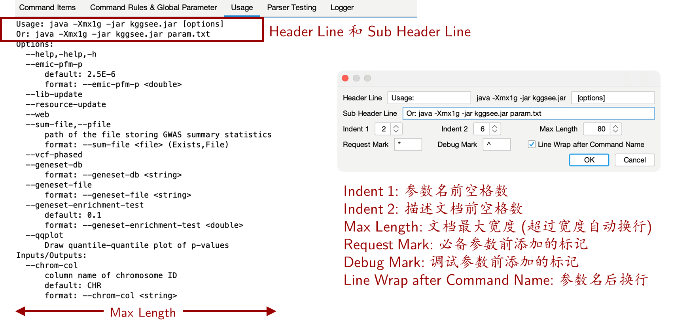

# 设置解析器全局属性

在 `Command Rules & Global Parameter` 标签页下部分设置解析器的全局属性。全局属性包含:

- **Program Name:** 程序名。

- **Usage Style:** 自动化文档的格式。双击复选框编辑格式，选择 “…” 创建新文档格式。

- **Offset:** 参数偏移量。

  - 跳过前面的 offset 个参数。

  - ```
    # offset = 3 时，传入的下列参数将跳过前 3 个参数，解析 "--level 5 -t 4 -o ~/test.gz"
    bgzip compress <file> --level 5 -t 4 -o ~/test.gz
    ```

- **Max Matched Items:** 最大匹配参数项个数，0 和 -1 表示不设置数量限制。

  - 传入的参数项达到最大个数时，后续的参数不再解析，而是作为最后一个匹配的参数项的值。

  - ```
    # maxMatchedItems = 1 时，下列参数只匹配 "bgzip"，剩下的参数 "compress <file> decompress <file>" 则作为 "bgzip" 参数项的值
     bgzip compress <file> decompress <file>
    ```

- **AutoHelp:** 在没有传入任何参数时，自动添加默认的 help 参数。

- **@Syntax:** @语法开关。

  - 在@语法下，识别 “@file” 类型参数，该参数被替换为 file 文件内容。

  - ```
    # file 文件内容为 compress <file> --level 5 -t 4，则下列语句解析值相同
    bgzip @file -o ~/test.gz
    bgzip compress <file> --level 5 -t 4 -o ~/test.gz
    ```

- **Debug:** 调试模式开关。标记为 “Debug” 的参数仅在调试模式下显示、可用; 在调试模式下将显示解析器工作日志。


# 设置自动化文档的格式

在 `Command Rules & Global Parameter` 标签页双击 `Usage Style` 复选框或下拉选择 `...`，打开文档格式编辑器。格式编辑器用于控制 `Usage` 标签页中的自动化文档格式 (如左图)，在 `Usage` 标签页中还可以进行复制、搜索 (快捷键: Ctrl + F)。

