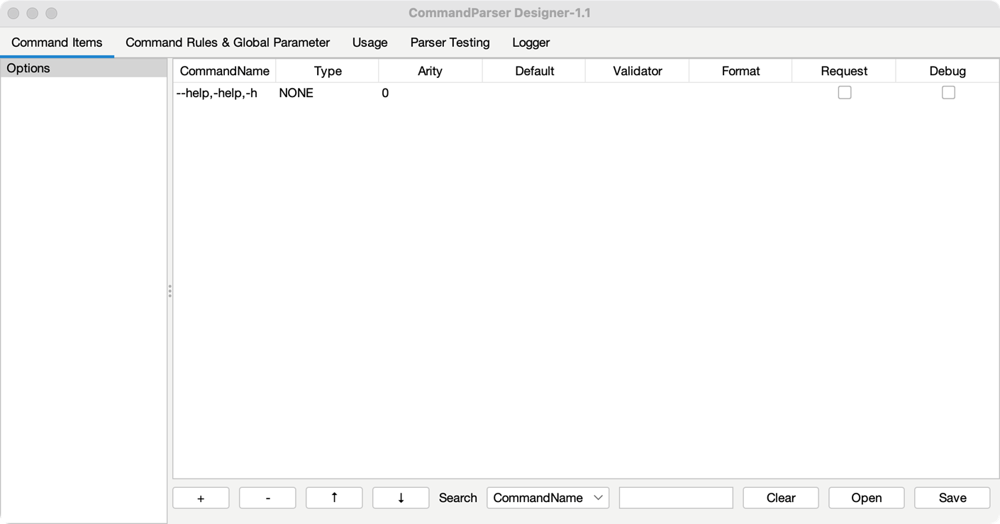
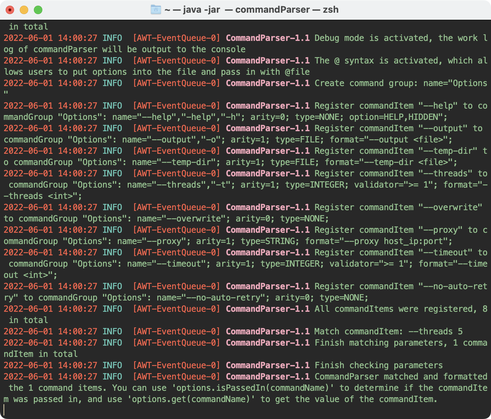

# 启动设计器图形界面 {#启动设计器图形界面}

在终端中输入 `java -jar ./commandParserDesigner-1.1.jar` 指令或双击软件，启动图形界面。



> [!TIP|label:设置快捷指令]
> Macos 或 Unix 系统可使用以下方式将 `java -jar ./commandParserDesigner-1.1.jar` 设置为快捷指令：
>
> ```bash
> # 打开环境变量文件
> vim ~/.zshrc
> 
> # 添加指令简写 (${path} 为 commandParserDesigner-1.1.jar 的绝对路径)
> alias commandParser="java -jar ${path}"
> 
> # 按下 Esc, 输入 ":x" 并按回车, 保存并退出该文件
> source ~/.zshrc
> ```

# 检查软件更新

在标签栏处点击鼠标右键，展开菜单。点击 "Check for Updates" 将检查 CommandParser 和 Command Parser Designer 是否有更新。


# 查看日志

在 Logger 标签页中，可以查看当前程序的工作日志，该日志系统基于 log4j + Logback 构建。

> [!DANGER|label:Command Parser Designer 仅作为单独软件包使用]
> 将日志重定向到 JSwing 面板需要在日志系统加载前启动 GUI 界面。因此当用户导入 commandParserDesigner.jar 作为包使用时，无论是否主动调用图形界面，GUI 组件都会被加载，影响主业务逻辑。


通过终端启动时，终端处也会同步显示日志信息 (当终端不支持该字符集时，会显示乱码):

