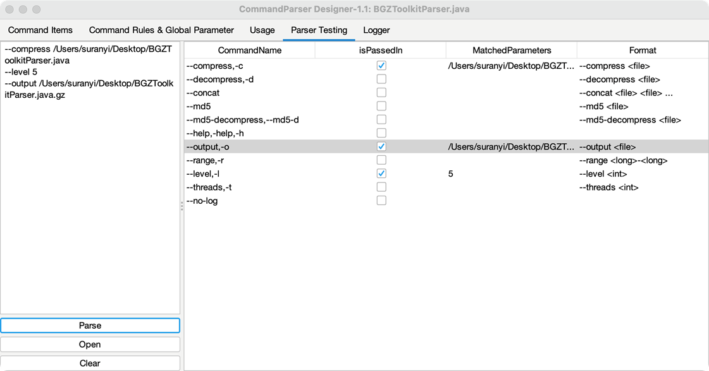

# 参数解析测试

在 `Parser Testing` 标签页中可进行参数解析测试，Debug 模式下将会显示更详细的解析日志。在编辑框中输入参数，并点击 `Parse` 按钮，右侧将显示解析器对该次指令的参数捕获情况:

- **isPassedIn:** 是否传入该参数
- **MatchedParameters:** 该参数项捕获的参数值
- **Format:** 输入格式 

双击参数项将跳转至 `Command Items` 标签页中的参数项位置。

