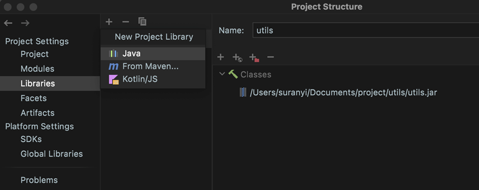
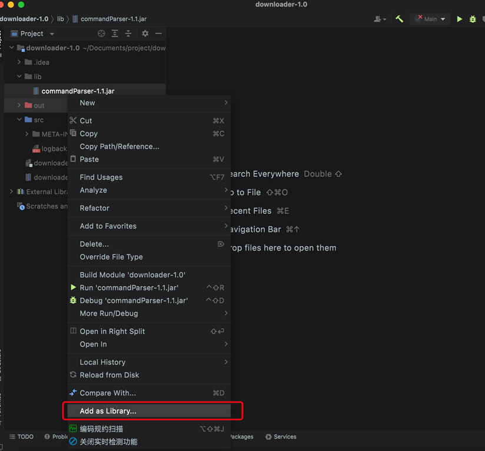
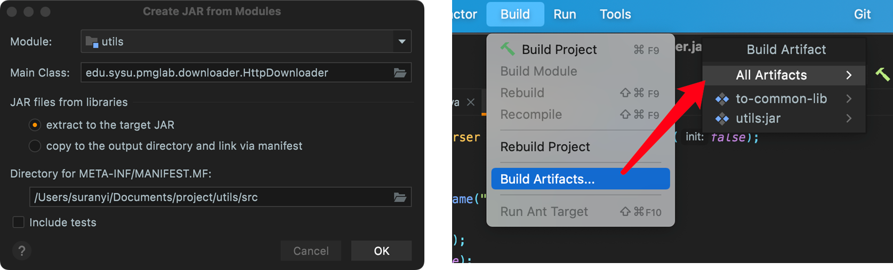

# 导入 CommandParser-1.1.jar

**方式一:** 在项目结构管理中选择 “Libraries”，添加 commandParser-1.1.jar.

**方式二:** 在工程项目中创建 lib 文件夹，添加 commandParser-1.1.jar，并右键点击 “Add as Library…”.

# 创建 Jar 包

创建解析器源代码文件、导入 commandParser-1.1.jar 包、编写入口函数后，就完成了完整的命令行程序开发。最后将 Java 工程项目打包为 jar 包 (以 IDEA 为例):

依次点击: Project Structure… > Artifacts > + > JAR > From modules with dependencies … 显示左图窗口。在 Main Class 处选择入口函数位置，点击 OK。最后，点击 Build > Build Artifacts 构建 jar 包。

